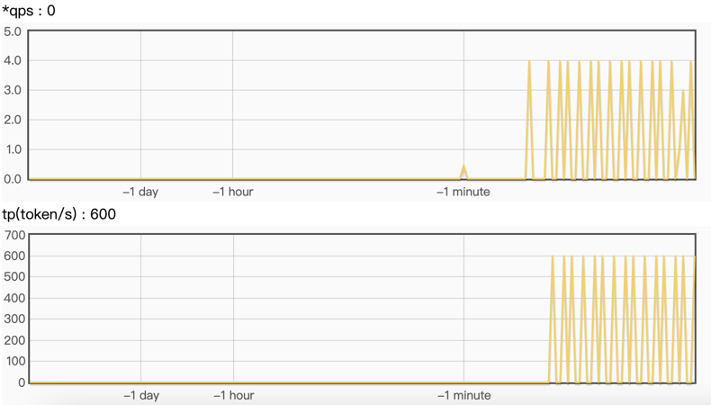

# grps-trtllm

## 目录

* [1. 说明](#1-说明)
* [2. 工程结构](#2-工程结构)
* [3. 本地开发与调试](#3-本地开发与调试)
    * [3.1 拉取代码](#31-拉取代码)
    * [3.2 创建容器](#32-创建容器)
    * [3.3 构建trtllm引擎](#33-构建trtllm引擎)
    * [3.3 修改inference.yml配置](#33-修改inferenceyml配置)
    * [3.5 构建与部署](#35-构建与部署)
    * [3.6 模拟请求](#36-模拟请求)
    * [3.7 指标观测](#37-指标观测)
    * [3.8 关闭服务](#38-关闭服务)
* [4. docker部署](#4-docker部署)
* [5. 与xinference-vllm性能比较](#5-与xinference-vllm性能比较)

## 1. 说明

[grps](https://github.com/NetEase-Media/grps)接入[trtllm](https://github.com/NVIDIA/TensorRT-LLM)
实现更高性能的、支持```OpenAI```模式访问的```LLM```
服务，相比较[triton-trtllm](https://github.com/triton-inference-server/tensorrtllm_backend)
实现服务。有如下优势：

* 通过纯```C++```实现完整```LLM```服务。包含```tokenizer```部分，支持`huggingface`, `sentencepiece`tokenizer。
* 不存在```triton_server <--> tokenizer_backend <--> trtllm_backend```之间的进程间通信。
* 通过```grps```的自定义```http```功能实现```OpenAI```接口协议，支持```chat```和```function call```模式。
* 支持扩展不同```LLM```的```prompt```构建风格以及生成结果的解析风格，以实现不同```LLM```的```chat```
  和```function call```模式，支持[llama-index](https://github.com/run-llama/llama_index)```ai-agent```。
* 通过测试，```grps-trtllm```相比较```triton-trtllm```性能有稳定的提升。

todo：

* 当前基于```tensorrt-llm v0.10.0```之后的版本进行的实现，最新支持到```v0.12.0```
  （主分支），具体见仓库的分支信息。由于人力受限，一些bug不能及时在每一个分支修复，请尽量使用最新版本分支。
* 由于不同家族系的```LLM```的```chat```和```function call```
  的```prompt```构建以及结果解析风格不同，所以需要实现不同```LLM```家族的```styler```，见```src/llm_styler.cc/.h```
  ，用户可以自行扩展。拓展后需要修改```conf/inference.yml```的```llm_style```为对应的家族名。
  不同家族的```styler```持续开发中...。
* 多模态LLM支持。

支持的```LLM styler```家族：

| llm_styler | chat | function_call | supported model                                                    |
|------------|------|---------------|--------------------------------------------------------------------|
| qwen2.5    | ✅    | ✅             | qwen2.5-instruct, qwen2.5-coder-instruct                           |
| qwen       | ✅    | ✅             | qwen1.5-chat, qwen1.5-moe-chat, qwen2-instruct, qwen2-moe-instruct |
| chatglm3   | ✅    | ✅             | chatglm3                                                           |
| glm4       | ✅    | ✅             | glm4-chat, glm4-chat-1m                                            |
| internlm2  | ✅    | ✅             | internlm2_5-chat, internlm2-chat                                   |
| llama3     | ✅    | ❌             | llama-3-instruct, llama-3.1-instruct                               |

## 2. 工程结构

```text
|-- client                              # 客户端样例
|   |--llamaindex_ai_agent.py           # 通过LlamaIndex实现AI Agent
|   |--openai_benchmark.py              # 通过OpenAI客户端进行benchmark
|   |--openai_cli.py                    # 通过OpenAI客户端进行chat
|   |--openai_func_call*.py             # 通过OpenAI客户端进行function call
|   |--openai_txt_cli.py                # 通过OpenAI客户端输入文本文件内容进行chat
|   |--triton_benchmark.py              # Triton trtllm server benchmark脚本
|   |--triton_cli.py                    # Triton trtllm server chat脚本
|   |--triton_txt_cli.py                # Triton trtllm server输入文本文件内容进行chat
|-- conf                                # 配置文件
|   |-- inference*.yml                  # 各类llm推理配置
|   |-- server.yml                      # 服务配置
|-- data                                # 数据文件
|-- docker                              # docker镜像构建
|-- docs                                # 文档
|-- second_party                        # grps框架依赖
|-- src                                 # 自定义源码
|   |-- constants.cc/.h                 # 常量定义
|   |-- customized_inferer.cc/.h        # 自定义推理器
|   |-- grps_server_customized.cc/.h    # 自定义库初始化
|   |-- llm_styler.cc/.h                # LLM风格定义，prompt构建，结果解析
|   |-- tokenizer.cc/.h                 # Tokenizer实现
|   |-- trtllm_model_instance.cc/.h     # TensorRT-LLM模型实例
|   |-- trtllm_model_state.cc/.h        # TensorRT-LLM模型状态
|   |-- utils.cc/.h                     # 工具
|   |-- main.cc                         # 本地单元测试
|-- third_party                         # 第三方依赖
|-- tools                               # 工具
|-- build.sh                            # 构建脚本
|-- CMakelists.txt                      # 工程构建文件
|-- .clang-format                       # 代码格式化配置文件
|-- .config                             # 工程配置文件，包含一些工程配置开关
```

## 3. 本地开发与调试

以qwen2.5-instruct为例。更多llm示例见[docs](./docs)，拉取代码与创建容器步骤相同。

### 3.1 拉取代码

```bash
git clone https://github.com/NetEase-Media/grps_trtllm.git
cd grps_trtllm
git submodule update --init --recursive
```

### 3.2 创建容器

使用```registry.cn-hangzhou.aliyuncs.com/opengrps/grps_gpu:grps1.1.0_cuda12.5_cudnn9.2_trtllm0.12.0_py3.10```镜像。
这里挂载了当前目录用于构建工程并保留构建产物，挂载/tmp目录用于保存构建的trtllm引擎文件。参考```triton-trtllm```
设置共享内存大小，解除物理内存锁定限制，设置栈大小，配置参数```--shm-size=2g --ulimit memlock=-1 --ulimit stack=67108864```。

```bash
# 创建容器
docker run -itd --name grps_trtllm_dev --runtime=nvidia --network host --shm-size=2g --ulimit memlock=-1 --ulimit stack=67108864 \
-v $(pwd):/grps_dev -v /tmp:/tmp -w /grps_dev \
registry.cn-hangzhou.aliyuncs.com/opengrps/grps_gpu:grps1.1.0_cuda12.5_cudnn9.2_trtllm0.12.0_py3.10 bash
# 进入开发容器
docker exec -it grps_trtllm_dev bash
```

### 3.3 构建trtllm引擎

```bash
# 下载Qwen2.5-7B-Instruct模型
apt update && apt install git-lfs
git lfs install
git clone https://huggingface.co/Qwen/Qwen2.5-7B-Instruct /tmp/Qwen2.5-7B-Instruct

# 进入TensorRT-LLM/examples/qwen目录，参考README进行构建trtllm引擎。
cd third_party/TensorRT-LLM/examples/qwen
# 转换ckpt
rm -rf /tmp/Qwen2.5-7B-Instruct/tllm_checkpoint/
python3 convert_checkpoint.py --model_dir /tmp/Qwen2.5-7B-Instruct \
--output_dir /tmp/Qwen2.5-7B-Instruct/tllm_checkpoint/ --dtype bfloat16 --load_model_on_cpu
# 构建引擎
rm -rf /tmp/Qwen2.5-7B-Instruct/trt_engines/
trtllm-build --checkpoint_dir /tmp/Qwen2.5-7B-Instruct/tllm_checkpoint/ \
--output_dir /tmp/Qwen2.5-7B-Instruct/trt_engines/ \
--gemm_plugin bfloat16 --max_batch_size 16 --paged_kv_cache enable \
--max_input_len 32256 --max_seq_len 32768 --max_num_tokens 32256
# 运行测试
python3 ../run.py --input_text "你好，你是谁？" --max_output_len=50 \
--tokenizer_dir /tmp/Qwen2.5-7B-Instruct/ \
--engine_dir=/tmp/Qwen2.5-7B-Instruct/trt_engines/
# 回到工程根目录
cd ../../../../
```

### 3.3 修改inference.yml配置

修改llm对应的conf/inference*.yml中```inferer_args```相关参数。注意修改```tokenizer_path```
和```gpt_model_path```为新路径，更多核心参数见如下：

```yaml
models:
  - name: trtllm_model
    ...
    inferer_args:
      # llm style used to build prompt(chat or function call) and parse generated response for openai interface.
      # Current support {`qwen2.5`, `qwen`, `chatglm3`, `glm4`, `internlm2`}.
      llm_style: qwen2.5

      # tokenizer config.
      tokenizer_type: huggingface # can be `huggingface`, `sentencepiece`. Must be set.
      tokenizer_path: /tmp/Qwen2.5-7B-Instruct/ # path of tokenizer. Must be set.
      tokenizer_parallelism: 16 # tokenizers count for parallel tokenization. Will be set to 1 if not set.
      end_token_id: 151645 # end token id of tokenizer. Null if not set.
      pad_token_id: 151643 # pad token id of tokenizer. Null if not set.
      skip_special_tokens: # skip special tokens when decoding. Empty if not set.
        - 151643 # "<|endoftext|>"
        - 151644 # "<|im_start|>"
        - 151645 # "<|im_end|>"
        ...
      force_tokens_dict: # will be used to force map tokens to ids when encode and decode instead of using tokenizer. Empty if not set.
      #  - token: "<|endoftext|>"
      #    id: 151643
      prefix_tokens_id: # prefix tokens id will be added to the beginning of the input ids. Empty if not set.
      suffix_tokens_id: # suffix tokens id will be added to the end of the input ids. Empty if not set.

      # trtllm config.
      gpt_model_type: inflight_fused_batching # must be `V1`(==`v1`) or `inflight_batching`(==`inflight_fused_batching`).
      gpt_model_path: /tmp/Qwen2.5-7B-Instruct/trt_engines/ # path of decoder model. Must be set.
      encoder_model_path: # path of encoder model. Null if not set.
      stop_words: # additional stop words. Empty if not set.
        - "<|im_start|>"
        - "<|im_end|>"
        - "<|endoftext|>"
      bad_words: # additional bad words. Empty if not set.
      batch_scheduler_policy: guaranteed_no_evict # must be `max_utilization` or `guaranteed_no_evict`.
      kv_cache_free_gpu_mem_fraction: 0.9 # will be set to 0.9 or `max_tokens_in_paged_kv_cache` if not set.
      exclude_input_in_output: true # will be set to false if not set.
```

### 3.5 构建与部署

```bash
# 构建
grpst archive .

# 部署，
# 通过--inference_conf参数指定模型对应的inference.yml配置文件启动服务。
# 如需修改服务端口，并发限制等，可以修改conf/server.yml文件，然后启动时指定--server_conf参数指定新的server.yml文件。
# 注意如果使用多卡推理，需要使用mpi方式启动，--mpi_np参数为并行推理的GPU数量。
grpst start ./server.mar --inference_conf=conf/inference_qwen2.5.yml

# 查看服务状态
grpst ps
# 如下输出
PORT(HTTP,RPC)      NAME                PID                 DEPLOY_PATH         
9997                my_grps             65322               /home/appops/.grps/my_grps
```

### 3.6 模拟请求

```bash
# curl命令非stream请求
curl --no-buffer http://127.0.0.1:9997/v1/chat/completions \
  -H "Content-Type: application/json" \
  -d '{
    "model": "qwen2.5-instruct",
    "messages": [
      {
        "role": "user",
        "content": "你好，你是谁？"
      }
    ]
  }'
# 返回如下：
: '
{
 "id": "chatcmpl-7",
 "object": "chat.completion",
 "created": 1726733862,
 "model": "qwen2.5-instruct",
 "system_fingerprint": "grps-trtllm-server",
 "choices": [
  {
   "index": 0,
   "message": {
    "role": "assistant",
    "content": "你好！我是Qwen，由阿里云开发的人工智能模型。我被设计用来提供信息、回答问题和进行各种对话任务。有什么我可以帮助你的吗？"
   },
   "logprobs": null,
   "finish_reason": "stop"
  }
 ],
 "usage": {
  "prompt_tokens": 34,
  "completion_tokens": 36,
  "total_tokens": 70
 }
}
'

# curl命令stream请求
curl --no-buffer http://127.0.0.1:9997/v1/chat/completions \
  -H "Content-Type: application/json" \
  -d '{
    "model": "qwen2.5-instruct",
    "messages": [
      {
        "role": "user",
        "content": "你好，你是谁？"
      }
    ],
    "stream": true
  }'
# 返回如下：
: '
data: {"id":"chatcmpl-8","object":"chat.completion.chunk","created":1726733878,"model":"qwen2.5-instruct","system_fingerprint":"grps-trtllm-server","choices":[{"index":0,"delta":{"role":"assistant","content":"你好"},"logprobs":null,"finish_reason":null}]}
data: {"id":"chatcmpl-8","object":"chat.completion.chunk","created":1726733878,"model":"qwen2.5-instruct","system_fingerprint":"grps-trtllm-server","choices":[{"index":0,"delta":{"content":"！"},"logprobs":null,"finish_reason":null}]}
data: {"id":"chatcmpl-8","object":"chat.completion.chunk","created":1726733878,"model":"qwen2.5-instruct","system_fingerprint":"grps-trtllm-server","choices":[{"index":0,"delta":{"content":"我是"},"logprobs":null,"finish_reason":null}]}
'

# 测试stop参数
curl --no-buffer http://127.0.0.1:9997/v1/chat/completions \
  -H "Content-Type: application/json" \
  -d '{
    "model": "qwen2.5-instruct",
    "messages": [
      {
        "role": "user",
        "content": "重复1234#END#5678"
      }
    ],
    "stop": ["#END#"]
  }'
# 返回如下：
: '
{
 "id": "chatcmpl-2",
 "object": "chat.completion",
 "created": 1727433345,
 "model": "qwen2.5-instruct",
 "system_fingerprint": "grps-trtllm-server",
 "choices": [
  {
   "index": 0,
   "message": {
    "role": "assistant",
    "content": "1234#END#"
   },
   "logprobs": null,
   "finish_reason": "stop"
  }
 ],
 "usage": {
  "prompt_tokens": 41,
  "completion_tokens": 7,
  "total_tokens": 48
 }
}
'

# openai_cli.py 非stream请求
python3 client/openai_cli.py 127.0.0.1:9997 "你好，你是谁？" false
# 返回如下：
: '
ChatCompletion(id='chatcmpl-9', choices=[Choice(finish_reason='stop', index=0, logprobs=None, message=ChatCompletionMessage(content='你好！我是Qwen，由阿里云开发的人工智能模型。我被设计用来提供信息、回答问题和进行各种对话任务。有什么我可以帮助你的吗？', refusal=None, role='assistant', function_call=None, tool_calls=None))], created=1726733895, model='', object='chat.completion', service_tier=None, system_fingerprint='grps-trtllm-server', usage=CompletionUsage(completion_tokens=36, prompt_tokens=34, total_tokens=70, completion_tokens_details=None))
'

# openai_cli.py stream请求
python3 client/openai_cli.py 127.0.0.1:9997 "你好，你是谁？" true
# 返回如下：
: '
ChatCompletionChunk(id='chatcmpl-10', choices=[Choice(delta=ChoiceDelta(content='你好', function_call=None, refusal=None, role='assistant', tool_calls=None), finish_reason=None, index=0, logprobs=None)], created=1726733914, model='', object='chat.completion.chunk', service_tier=None, system_fingerprint='grps-trtllm-server', usage=None)
ChatCompletionChunk(id='chatcmpl-10', choices=[Choice(delta=ChoiceDelta(content='！', function_call=None, refusal=None, role=None, tool_calls=None), finish_reason=None, index=0, logprobs=None)], created=1726733914, model='', object='chat.completion.chunk', service_tier=None, system_fingerprint='grps-trtllm-server', usage=None)
ChatCompletionChunk(id='chatcmpl-10', choices=[Choice(delta=ChoiceDelta(content='我是', function_call=None, refusal=None, role=None, tool_calls=None), finish_reason=None, index=0, logprobs=None)], created=1726733914, model='', object='chat.completion.chunk', service_tier=None, system_fingerprint='grps-trtllm-server', usage=None)
'

# 输入32k长文本小说验证长文本的支持
python3 client/openai_txt_cli.py 127.0.0.1:9997 ./data/32k_novel.txt "上面这篇小说作者是谁？" false
# 返回如下：
: '
ChatCompletion(id='chatcmpl-11', choices=[Choice(finish_reason='stop', index=0, logprobs=None, message=ChatCompletionMessage(content='这篇小说的作者是弦三千。', refusal=None, role='assistant', function_call=None, tool_calls=None))], created=1726733931, model='', object='chat.completion', service_tier=None, system_fingerprint='grps-trtllm-server', usage=CompletionUsage(completion_tokens=8, prompt_tokens=31615, total_tokens=31623, completion_tokens_details=None))
'

# 输入32k长文本小说进行总结
python3 client/openai_txt_cli.py 127.0.0.1:9997 ./data/32k_novel.txt "简述一下上面这篇小说的前几章内容。" false
# 返回如下：
: '
ChatCompletion(id='chatcmpl-12', choices=[Choice(finish_reason='stop', index=0, logprobs=None, message=ChatCompletionMessage(content='以下是《拜托，只想干饭的北极熊超酷的！》前几章的主要内容概述：\n\n1. **第一章**：楚云霁意外穿越成了一只北极熊，他发现了一群科考队，并用鱼与他们交流。楚云霁在暴风雪中艰难生存，通过抓鱼和捕猎海豹来获取食物。\n\n2. **第二章**：楚云霁在暴风雪后继续捕猎，遇到了一只北极白狼。白狼似乎对楚云霁很友好，甚至带他去捕猎海豹。楚云霁吃了一顿饱饭后，与白狼一起回到白狼的洞穴休息。\n\n3. **第三章**：楚云霁在白狼的洞穴中休息，醒来后发现白狼已经离开。他继续捕猎，遇到了一群海豹，但海豹很快被一只成年北极熊吓跑。楚云霁在冰面上发现了一群生蚝，但白狼对生蚝不感兴趣，楚云霁只好自己吃了。\n\n4. **第四章**：楚云霁在捕猎时遇到了一只成年北极熊，成年北极熊似乎在挑衅他。楚云霁和白狼一起捕猎了一只驯鹿，分享了食物。直播设备记录下了这一幕，引起了观众的热议。\n\n5. **第五章**：楚云霁和白狼一起捕猎了一只驯鹿，分享了食物。楚云霁在捕猎时遇到了一只北极狐，但北极狐被北极熊吓跑。楚云霁还遇到了一只海鸟，海鸟试图抢食，但被白狼赶走。楚云霁和白狼一起处理了一只驯鹿，白狼还帮助楚云霁取下了鹿角。\n\n6. **第六章**：楚云霁和白狼一起捕猎，楚云霁在冰面上睡觉时被冰面漂走。醒来后，楚云霁发现白狼还在身边，感到非常高兴。他们一起捕猎了一只海象，但海象偷走了鱼竿。楚云霁和白狼一起追捕海象，最终成功捕获了海象。\n\n7. **第七章**：楚云霁和白狼一起捕猎，楚云霁发现了一根鱼竿。他们一起用鱼竿钓鱼，但鱼竿被海象带走。楚云霁和白狼一起追捕海象，最终成功捕获了海象。楚云霁和白狼一起分享了海象肉。\n\n8. **第八章**：楚云霁和白狼一起捕猎，楚云霁发现了一根鱼竿。他们一起用鱼竿钓鱼，但鱼竿被海象带走。楚云霁和白狼一起追捕海象，最终成功捕获了海象。楚云霁和白狼一起分享了海象肉。\n\n9. **第九章**：楚云霁和白狼一起捕猎，楚云霁发现了一根鱼竿。他们一起用鱼竿钓鱼，但鱼竿被海象带走。楚云霁和白狼一起追捕海象，最终成功捕获了海象。楚云霁和白狼一起分享了海象肉。\n\n10. **第十章**：楚云霁和白狼一起捕猎，楚云霁发现了一根鱼竿。他们一起用鱼竿钓鱼，但鱼竿被海象带走。楚云霁和白狼一起追捕海象，最终成功捕获了海象。楚云霁和白狼一起分享了海象肉。\n\n11. **第十一章**：楚云霁在白狼的洞穴中发现了一个背包，背包里装满了各种食物和补给品。楚云霁和白狼一起分享了这些食物，包括罐头和海带。楚云霁还和白狼一起出去捕猎，但没有成功。\n\n12. **第十二章**：楚云霁和白狼一起出去捕猎，楚云霁发现了一根鱼竿。他们一起用鱼竿钓鱼，但鱼竿被海象带走。楚云霁和白狼一起追捕海象，最终成功捕获了海象。楚云霁和白狼一起分享了海象肉，并一起出去探索周围的环境。楚云霁还发现了一个背包，背包里装满了各种食物和补给品。楚云霁和白狼一起分享了这些食物，包括罐头和海带。楚云霁还和白狼一起出去捕猎，但没有成功。', refusal=None, role='assistant', function_call=None, tool_calls=None))], created=1726733966, model='', object='chat.completion', service_tier=None, system_fingerprint='grps-trtllm-server', usage=CompletionUsage(completion_tokens=959, prompt_tokens=31621, total_tokens=32580, completion_tokens_details=None))
'

# openai_func_call.py进行function call模拟
python3 client/openai_func_call.py 127.0.0.1:9997
# 返回如下：
: '
Query server with question: What's the weather like in Boston today? ...
Server response: thought: None, call local function(get_current_weather) with arguments: location=Boston, MA, unit=fahrenheit
Send the result back to the server with function result(59.0) ...
Final server response: The current temperature in Boston today is 59°F.
'

# openai_func_call2.py进行一次两个函数的function call模拟
python3 client/openai_func_call2.py 127.0.0.1:9997
# 返回如下：
: '
Query server with question: What's the postcode of Boston and what's the weather like in Boston today? ...
Server response: thought: None, call local function(get_postcode) with arguments: location=Boston, MA
Server response: thought: None, call local function(get_current_weather) with arguments: location=Boston, MA, unit=fahrenheit
Send the result back to the server with function result ...
Final server response: The postcode for Boston, MA is 02138. The current temperature in Boston today is 59.0°F.
'

# llama-index ai agent模拟
python3 client/llamaindex_ai_agent.py 127.0.0.1:9997
# 返回如下：
: '
Query: What is the weather in Boston today?
Added user message to memory: What is the weather in Boston today?
=== Calling Function ===
Calling function: get_weather with args: {"location":"Boston, MA","unit":"fahrenheit"}
Got output: 59.0
========================

Response: The current temperature in Boston is 59.0 degrees Fahrenheit.
'
```

### 3.7 指标观测

通过访问```http://ip:9997/``` 可以查看服务的指标信息。如下指标：
<br>


### 3.8 关闭服务

```bash
# 关闭服务
grpst stop my_grps
```

## 4. docker部署

```bash
# 更新conf/inference.yml软链接为具体的inference*.yml配置文件
rm -f conf/inference.yml
ln -s conf/inference_qwen2.5.yml conf/inference.yml
# 构建自定义工程docker镜像
docker build -t grps_trtllm_server:1.0.0 -f docker/Dockerfile .

# 使用上面构建好的镜像启动docker容器
# 注意挂载/tmp目录，因为构建的trtllm引擎文件在/tmp目录下
# 映射服务端口9997
# 注意如果使用多卡推理，需要使用mpi方式启动，--mpi_np参数为并行推理的GPU数量。
docker run -itd --runtime=nvidia --name="grps_trtllm_server" --shm-size=2g --ulimit memlock=-1 \
--ulimit stack=67108864 -v /tmp:/tmp -p 9997:9997 \
grps_trtllm_server:1.0.0 grpst start server.mar

# 使用docker logs可以跟踪服务日志
docker logs -f grps_trtllm_server

# 模拟请求见3.6章节所述

# 关闭容器
docker rm -f grps_trtllm_server
```

### 5. 与xinference-vllm性能比较

这里不再比较与```triton-trtllm```性能，因为它不是```OpenAI```协议。比较与```xinference-vllm```服务的性能差异。

```
GPU: RTX 2080Ti * 4
CUDA: cuda_12.4
Trtllm: 0.10.0
xinference: 0.14.1
vLLM: 0.5.4
CPU: Intel(R) Xeon(R) Gold 6242R CPU @ 3.10GHz
Mem：128G
LLM: Qwen2-7B
```

短输入输出：
固定输入（华盛顿是谁？），输入输出总长度140 tokens左右。

| 服务 \ 吞吐(tokens/s) \ 并发 | 1       | 2       | 4       | 6       | 8       | 10      | 16      |
|------------------------|---------|---------|---------|---------|---------|---------|---------|
| xinference-vllm        | 98.79   | 181.76  | 343.55  | 436.62  | 580.80  | 660.71  | 968.86  |
| grps-trtllm            | 128.57  | 231.68  | 429.19  | 561.54  | 714.15  | 836.60  | 1226.88 |
| 同比                     | +30.14% | +27.46% | +24.93% | +28.61% | +22.96% | +26.62% | +26.63% |

长输入输出：
固定输入为1.2k左右tokens数量的文章，输出为150左右token数量的总结。

| 服务 \ 吞吐(tokens/s) \ 并发 | 1       | 2       | 4       | 6       | 8       | 10      | 16      |
|------------------------|---------|---------|---------|---------|---------|---------|---------|
| xinference-vllm        | 681.38  | 1112.14 | 1797.84 | 2135.98 | 2507.70 | 2669.51 | 3511.76 |
| grps-trtllm            | 797.51  | 1300.54 | 2042.17 | 2400.99 | 2763.28 | 2947.73 | 3637.28 |
| 同比                     | +17.04% | +16.94% | +13.59% | +12.41% | +10.19% | +10.42% | +3.57%  |
