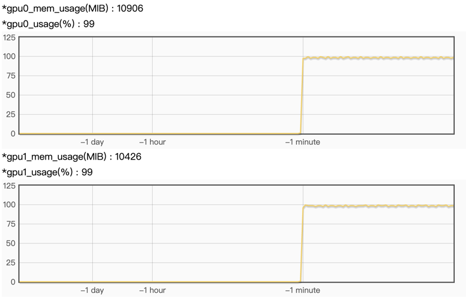

# grps-trtllm

* [1. 工程结构](#1-工程结构)
* [2. 本地开发与调试](#2-本地开发与调试)
    * [2.1 拉取代码](#21-拉取代码)
    * [2.2 创建容器](#22-创建容器)
    * [2.3 构建trtllm引擎](#23-构建trtllm引擎)
    * [2.3 修改trtllm_inferer参数](#23-修改trtllm_inferer参数)
    * [2.5 构建与部署](#25-构建与部署)
    * [2.6 模拟请求](#26-模拟请求)
    * [2.7 指标观测](#27-指标观测)
    * [2.8 关闭](#28-关闭)
* [3. docker部署](#3-docker部署)
* [4. 性能比较](#4-性能比较)

[grps](https://github.com/NetEase-Media/grps)接入[TensorRT-LLM](https://github.com/NVIDIA/TensorRT-LLM)
实现```LLM```服务，相比较[triton-trtllm-server](https://github.com/triton-inference-server/tensorrtllm_backend)
实现```LLM```服务，有如下优势：

1. 通过纯```C++```实现完整```LLM```服务，包含```tokenizer```部分。
2. 不存在```triton_server <--> tokenizer_backend <--> trtllm_backend```之间的进程间通信。
3. 通过```grps```的自定义```http```功能实现```OpenAI```接口协议，支持```chat```和```function call```模式。
4. 支持扩展不同```LLM```的```prompt```构建风格以及生成结果的解析风格，以实现不同```LLM```的```chat```
   和```function call```模式。
5. 通过测试，```grps-trtllm```相比较```triton-trtllm-server```性能有稳定的提升。

当前问题：

1. 由于不同家族系的```LLM```的```chat```和```function call```
   的prompt构建以及结果解析风格不同，所以需要实现不同LLM家族的styler，见```src/llm_styler.cc/.h```。目前仅实现了```qwen```
   ，后续可以实现其他家族的```styler```，用户可以自行扩展。拓展后需要修改```conf/inference.yml```的```llm_style```为对应的家族名。
   不同家族的```styler```持续开发中...。
2. 当前基于```TensorRT-LLM  v0.10.0```进行的实现，新版本持续支持中...。
3. grps刚支持trtllm没多久，欢迎提交```pr```贡献支持更多的```LLM```家族的```styler```以及修复bug。

## 1. 工程结构

```text
|-- client                              # 客户端样例
|   |--http_benchmark.py                # 压测脚本
|   |--openai_cli.py                    # 通过OpenAI客户端进行chat
|   |--openai_func_call.py              # 通过OpenAI客户端进行function call
|-- conf                                # 配置文件
|   |-- inference.yml                   # 推理配置
|   |-- server.yml                      # 服务配置
|-- data                                # 数据文件
|-- docker                              # docker镜像构建
|-- second_party                        # 第二方依赖
|   |-- grps-server-framework           # grps框架依赖
|-- src                                 # 自定义源码
|   |-- customized_converter.cc/.h      # 自定义前后处理转换器
|   |-- customized_inferer.cc/.h        # 自定义推理器
|   |-- grps_server_customized.cc/.h    # 自定义库初始化
|   |-- llm_styler.cc/.h                # LLM风格定义，prompt构建，结果解析
|   |-- tokenizer.cc/.h                 # Tokenizer实现
|   |-- trtllm_model_instance.cc/.h     # TensorRT-LLM模型实例
|   |-- trtllm_model_state.cc/.h        # TensorRT-LLM模型状态
|   |-- utils.cc/.h                     # 工具
|   |-- main.cc                         # 本地单元测试
|-- third_party                         # 第三方依赖
|-- build.sh                            # 构建脚本
|-- CMakelists.txt                      # 工程构建文件
|-- .clang-format                       # 代码格式化配置文件
|-- .config                             # 工程配置文件，包含一些工程配置开关
```

## 2. 本地开发与调试

以qwen2为例。

### 2.1 拉取代码

```bash
git clone git@github.com:NetEase-Media/grps_trtllm.git
cd grps_trtllm
git submodule update --init --recursive
```

### 2.2 创建容器

使用```registry.cn-hangzhou.aliyuncs.com/opengrps/grps_gpu:grps1.1.0_cuda12.4_cudnn8.9_trtllm0.10.0_py3.10```镜像。
这里挂载了当前目录用于构建工程并保留构建产物，挂载/tmp目录用于保存构建的trtllm引擎文件。```--shm-size=2g --ulimit memlock=-1```
用于设置共享内存大小和解锁内存限制。

```bash
# 创建容器
docker run -itd --name grps_trtllm_dev --runtime=nvidia --network host --shm-size=2g --ulimit memlock=-1 \
-v $(pwd):/grps_dev -v /tmp:/tmp -w /grps_dev \
registry.cn-hangzhou.aliyuncs.com/opengrps/grps_gpu:grps1.1.0_cuda12.4_cudnn8.9_trtllm0.10.0_py3.10 bash
# 进入开发容器
docker exec -it grps_trtllm_dev bash
```

### 2.3 构建trtllm引擎

```bash
# 下载Qwen2-7B模型
apt update && apt install git-lfs
git lfs install
git clone https://huggingface.co/Qwen/Qwen2-7B /tmp/Qwen2-7B

# 进入TensorRT-LLM/examples/qwen目录，参考README进行构建trtllm引擎。
cd third_party/TensorRT-LLM/examples/qwen
# 这里以tp4为例进行构建，即使用4张卡进行tensor并行推理
# 转换ckpt
python3 convert_checkpoint.py --model_dir /tmp/Qwen2-7B \
--output_dir /tmp/Qwen2-7B/tllm_checkpoint_4gpu_tp4/ --dtype float16 --tp_size 4
# 构建引擎，当出现OOM，可以适当缩小max_batch_size，max_input_len，max_output_len等参数
trtllm-build --checkpoint_dir /tmp/Qwen2-7B/tllm_checkpoint_4gpu_tp4/ \
--output_dir /tmp/Qwen2-7B/trt_engines/fp16_4gpu/ \
--gemm_plugin float16 --context_fmha disable --use_custom_all_reduce disable \
--max_batch_size 16 --paged_kv_cache enable --max_input_len 2048 --max_output_len 512
# 回到工程根目录
cd ../../../../
```

### 2.3 修改trtllm_inferer参数

修改[conf/inference.yml](conf/inference.yml)中```inferer_args```相关参数。注意修改```tokenizer_path```
和```gpt_model_path```为新路径，更多核心参数见如下：

```yaml
    inferer_args:
      # llm style used to build prompt(chat or function call) and parse generated response for openai interface.
      # Current support {`qwen`}.
      llm_style: qwen

      # tokenizer config.
      # path of tokenizer. Must be set. Could be tokenizer.json(hf tokenizer), tokenizer.model(sentencepiece
      # tokenizer) or tokenizer_model(RWKV world tokenizer).
      tokenizer_path: /tmp/Qwen2-7B/tokenizer.json
      tokenizer_parallelism: 16 # tokenizers count for parallel tokenization. Will be set to 1 if not set.
      end_token_id: 151643 # end token id of tokenizer. Null if not set.
      pad_token_id: 151643 # pad token id of tokenizer. Null if not set.
      stop_words: # additional stop words of tokenizer. Empty if not set.
        - "<|im_start|>"
        - "<|im_end|>"
        - "<|endoftext|>"
      bad_words: # additional bad words of tokenizer. Empty if not set.
      special_tokens_id: # special tokens of tokenizer. Empty if not set.
        - 151643 # "<|endoftext|>"
        - 151644 # "<|im_start|>"
        - 151645 # "<|im_end|>"
      skip_special_tokens: true # skip special tokens when decoding. Will be set to true if not set.

      # trtllm config.
      gpt_model_type: inflight_fused_batching # must be `V1`(==`v1`) or `inflight_batching`(==`inflight_fused_batching`).
      gpt_model_path: /tmp/Qwen2-7B/trt_engines/fp16_4gpu/ # path of model. Must be set.
      batch_scheduler_policy: guaranteed_no_evict # must be `max_utilization` or `guaranteed_no_evict`.
      kv_cache_free_gpu_mem_fraction: 0.6 # will be set to 0.9 or `max_tokens_in_paged_kv_cache` if not set.
      exclude_input_in_output: true # will be set to false if not set.
```

### 2.5 构建与部署

```bash
# 构建
grpst archive .

# 部署，注意使用mpi方式启动，参数为并行推理的GPU数量
# 首次构建完后，修改配置后可以直接启动服务无需重新构建，通过--inference_conf以及--server_conf参数指定.
# grpst start --inference_conf=conf/inference.yml --server_conf=conf/server.yml --mpi_np 4
grpst start ./server.mar --mpi_np 4

# 查看服务状态
grpst ps
# 如下输出
PORT(HTTP,RPC)      NAME                PID                 DEPLOY_PATH         
9997                my_grps             65322               /home/appops/.grps/my_grps
```

### 2.6 模拟请求

```bash
# curl命令非stream请求
curl --no-buffer http://127.0.0.1:9997//v1/chat/completions \
  -H "Content-Type: application/json" \
  -d '{
    "model": "qwen2",
    "messages": [
      {
        "role": "system",
        "content": "You are a helpful assistant."
      },
      {
        "role": "user",
        "content": "你好，你是谁？"
      }
    ]
  }'

# curl命令stream请求
curl --no-buffer http://127.0.0.1:9997//v1/chat/completions \
  -H "Content-Type: application/json" \
  -d '{
    "model": "qwen2",
    "messages": [
      {
        "role": "system",
        "content": "You are a helpful assistant."
      },
      {
        "role": "user",
        "content": "你好，你是谁？"
      }
    ],
    "stream": true
  }'

# openai_cli.py 非stream请求
python3 client/openai_cli.py 127.0.0.1:9997 "你好，你是谁？" false

# openai_cli.py stream骑牛
python3 client/openai_cli.py 127.0.0.1:9997 "你好，你是谁？" true

# openai_func_call.py进行function call模拟
python3 client/openai_func_call.py 127.0.0.1:9997
```

### 2.7 指标观测

通过访问```http://ip:9997/``` 可以查看服务的指标信息。如下指标：
<br>


### 2.8 关闭

```bash
# 关闭服务
grpst stop my_grps
```

## 3. docker部署

```bash
# 构建自定义工程docker镜像
docker build -t grps_trtllm_server:1.0.0 -f docker/Dockerfile .

# 使用上面构建好的镜像启动docker容器
# 注意挂载/tmp目录，因为构建的trtllm引擎文件在/tmp目录下
# 映射服务端口9997
docker run -itd --runtime=nvidia --name="grps_trtllm_server" --shm-size=2g --ulimit memlock=-1 -v /tmp:/tmp -p 9997:9997 \
grps_trtllm_server:1.0.0 grpst start server.mar --mpi_np 4

# 使用docker logs可以跟踪服务日志
docker logs -f grps_trtllm_server

# 模拟请求见2.6章节所述

# 关闭容器
docker rm -f grps_trtllm_server
```

### 4. 性能比较

这里不再比较与```triton-trtllm-server```性能，因为它不是OpenAI协议。比较与```xinference-vllm```服务的性能差异。

```
GPU: RTX 2080Ti * 4
CUDA: cuda_12.4
Triton-trtllm-backend: 0.10.0
Trtllm: 0.10.0
xinference: 0.14.1
vLLM: 0.5.4
CPU: Intel(R) Xeon(R) Gold 6242R CPU @ 3.10GHz
Mem：128G
```

短输入输出：
固定输入（华盛顿是谁？），输入输出总长度140 tokens左右。

| 服务 \ 吞吐(tokens/s) \ 并发 | 1       | 2       | 4       | 6       | 8       | 10      | 16      |
|------------------------|---------|---------|---------|---------|---------|---------|---------|
| xinference-vllm        | 98.79   | 181.76  | 343.55  | 436.62  | 580.80  | 660.71  | 968.86  |
| grps-trtllm            | 128.57  | 231.68  | 429.19  | 561.54  | 714.15  | 836.60  | 1226.88 |
| 同比                     | +30.14% | +27.46% | +24.93% | +28.61% | +22.96% | +26.62% | +26.63% |

长输入输出：
固定输入为1.2k左右tokens数量的文章，输出为150左右token数量的总结。

| 服务 \ 吞吐(tokens/s) \ 并发 | 1       | 2       | 4       | 6       | 8       | 10      | 16      |
|------------------------|---------|---------|---------|---------|---------|---------|---------|
| xinference-vllm        | 681.38  | 1112.14 | 1797.84 | 2135.98 | 2507.70 | 2669.51 | 3511.76 |
| grps-trtllm            | 797.51  | 1300.54 | 2042.17 | 2400.99 | 2763.28 | 2947.73 | 3637.28 |
| 同比                     | +17.04% | +16.94% | +13.59% | +12.41% | +10.19% | +10.42% | +3.57%  |