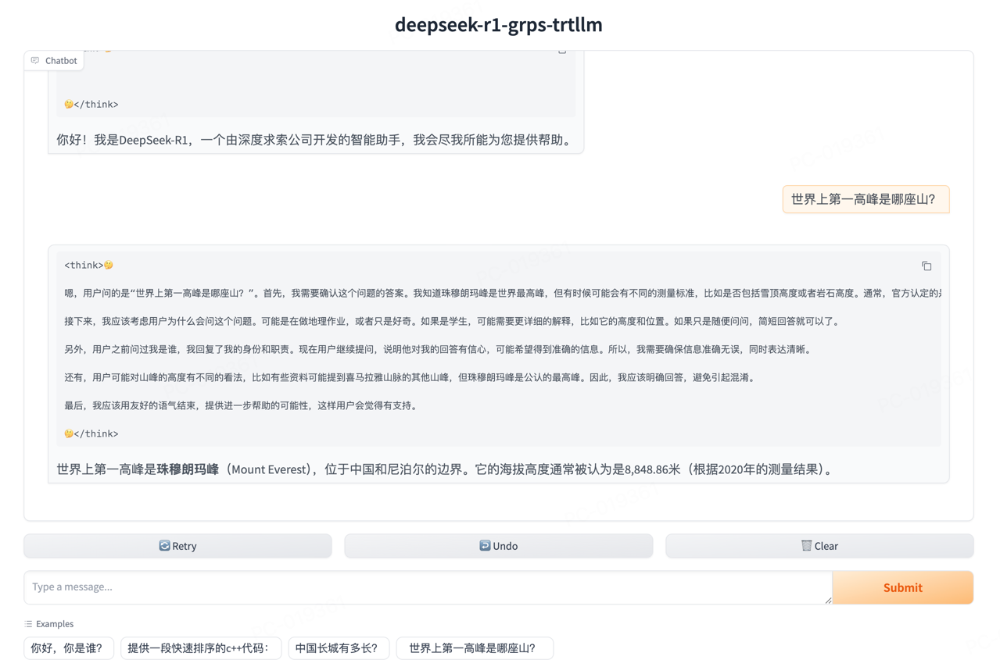

# deepseek-r1-distill

deepseek-r1蒸馏模型部署样例，不同尺寸对应不同的蒸馏base模型，如下表：

|           **Model**           |                                   **Base Model**                                   |                                    **Download**                                    |
|:-----------------------------:|:----------------------------------------------------------------------------------:|:----------------------------------------------------------------------------------:|
| DeepSeek-R1-Distill-Qwen-1.5B |         [Qwen2.5-Math-1.5B](https://huggingface.co/Qwen/Qwen2.5-Math-1.5B)         | [🤗 HuggingFace](https://huggingface.co/deepseek-ai/DeepSeek-R1-Distill-Qwen-1.5B) |
|  DeepSeek-R1-Distill-Qwen-7B  |           [Qwen2.5-Math-7B](https://huggingface.co/Qwen/Qwen2.5-Math-7B)           |  [🤗 HuggingFace](https://huggingface.co/deepseek-ai/DeepSeek-R1-Distill-Qwen-7B)  |
| DeepSeek-R1-Distill-Llama-8B  |           [Llama-3.1-8B](https://huggingface.co/meta-llama/Llama-3.1-8B)           | [🤗 HuggingFace](https://huggingface.co/deepseek-ai/DeepSeek-R1-Distill-Llama-8B)  |
| DeepSeek-R1-Distill-Qwen-14B  |               [Qwen2.5-14B](https://huggingface.co/Qwen/Qwen2.5-14B)               | [🤗 HuggingFace](https://huggingface.co/deepseek-ai/DeepSeek-R1-Distill-Qwen-14B)  |
| DeepSeek-R1-Distill-Qwen-32B  |               [Qwen2.5-32B](https://huggingface.co/Qwen/Qwen2.5-32B)               | [🤗 HuggingFace](https://huggingface.co/deepseek-ai/DeepSeek-R1-Distill-Qwen-32B)  |
| DeepSeek-R1-Distill-Llama-70B | [Llama-3.3-70B-Instruct](https://huggingface.co/meta-llama/Llama-3.3-70B-Instruct) | [🤗 HuggingFace](https://huggingface.co/deepseek-ai/DeepSeek-R1-Distill-Llama-70B) |

## 演示



## 开发环境

见[快速开始](../README.md#快速开始)的拉取代码和创建容器部分。

## 构建trtllm引擎

### 1.5B\7B\14B\32B

以DeepSeek-R1-Distill-Qwen-7B为例。

```bash
# 下载DeepSeek-R1-Distill-Qwen-7B模型
apt update && apt install git-lfs
git lfs install
git clone https://huggingface.co/deepseek-ai/DeepSeek-R1-Distill-Qwen-7B /tmp/DeepSeek-R1-Distill-Qwen-7B

# 进入TensorRT-LLM/examples/qwen目录，参考README进行构建trtllm引擎。
cd third_party/TensorRT-LLM/examples/qwen
# 转换ckpt
rm -rf /tmp/DeepSeek-R1-Distill-Qwen-7B/tllm_checkpoint/
python3 convert_checkpoint.py --model_dir /tmp/DeepSeek-R1-Distill-Qwen-7B \
--output_dir /tmp/DeepSeek-R1-Distill-Qwen-7B/tllm_checkpoint/ --dtype bfloat16 --load_model_on_cpu
# 构建引擎
rm -rf /tmp/DeepSeek-R1-Distill-Qwen-7B/trt_engines/
trtllm-build --checkpoint_dir /tmp/DeepSeek-R1-Distill-Qwen-7B/tllm_checkpoint/ \
--output_dir /tmp/DeepSeek-R1-Distill-Qwen-7B/trt_engines/ \
--gemm_plugin bfloat16 --max_batch_size 16 --paged_kv_cache enable --use_paged_context_fmha enable \
--max_input_len 32256 --max_seq_len 32768 --max_num_tokens 32256
# 回到工程根目录
cd ../../../../
```

### 8B\70B

以DeepSeek-R1-Distill-Llama-8B为例。

```bash
# 下载DeepSeek-R1-Distill-Llama-8B模型
apt update && apt install git-lfs
git lfs install
git clone https://huggingface.co/deepseek-ai/DeepSeek-R1-Distill-Llama-8B /tmp/DeepSeek-R1-Distill-Llama-8B

# 进入TensorRT-LLM/examples/qwen目录，参考README进行构建trtllm引擎。
cd third_party/TensorRT-LLM/examples/llama/
# 转换ckpt
rm -rf /tmp/DeepSeek-R1-Distill-Llama-8B/tllm_checkpoint/
python3 convert_checkpoint.py --model_dir /tmp/DeepSeek-R1-Distill-Llama-8B \
--output_dir /tmp/DeepSeek-R1-Distill-Llama-8B/tllm_checkpoint/ --dtype bfloat16 --load_model_on_cpu
# 构建引擎
rm -rf /tmp/DeepSeek-R1-Distill-Llama-8B/trt_engines/
trtllm-build --checkpoint_dir /tmp/DeepSeek-R1-Distill-Llama-8B/tllm_checkpoint/ \
--output_dir /tmp/DeepSeek-R1-Distill-Llama-8B/trt_engines/ \
--gemm_plugin bfloat16 --max_batch_size 16 --paged_kv_cache enable --use_paged_context_fmha enable \
--max_input_len 32256 --max_seq_len 32768 --max_num_tokens 32256
# 回到工程根目录
cd ../../../../
```

## 构建与部署

注意不同尺寸的inference.yml可以根据LLM类型分别参考不同inference.yml文件并改模型路径。基于Qwen2.5（1.5B\7B\14B\32B）的LLM参考[inference_deepseek-r1-distill-qwen.yml](../conf/inference_deepseek-r1-distill-qwen.yml)
，基于llama3（8B\70B）的LLM参考[inference_deepseek-r1-distill-llama.yml](../conf/inference_deepseek-r1-distill-llama.yml)。

```bash
# 构建
grpst archive .

# 部署，
# 通过--inference_conf参数指定模型对应的inference.yml配置文件启动服务。
# 如需修改服务端口，并发限制等，可以修改conf/server.yml文件，然后启动时指定--server_conf参数指定新的server.yml文件。
# 注意如果使用多卡推理，需要使用mpi方式启动，--mpi_np参数为并行推理的GPU数量。
# grpst start ./server.mar --inference_conf=conf/inference_deepseek-r1-distill-llama.yml
grpst start ./server.mar --inference_conf=conf/inference_deepseek-r1-distill-qwen.yml

# 查看服务状态
grpst ps
# 如下输出
PORT(HTTP,RPC)      NAME                PID                 DEPLOY_PATH         
9997                my_grps             65322               /home/appops/.grps/my_grps
```

## 模拟请求

```bash
# curl命令非stream请求``
curl --no-buffer http://127.0.0.1:9997/v1/chat/completions \
  -H "Content-Type: application/json" \
  -d '{
    "model": "DeepSeek-R1-Distill-Qwen-7B",
    "messages": [
      {
        "role": "user",
        "content": "你好，你是谁？"
      }
    ]
  }'
# 返回如下：
: '
{
 "id": "chatcmpl-1",
 "object": "chat.completion",
 "created": 1739277438,
 "model": "DeepSeek-R1-Distill-Qwen-7B",
 "system_fingerprint": "grps-trtllm-server",
 "choices": [
  {
   "index": 0,
   "message": {
    "role": "assistant",
    "content": "您好！我是由中国的深度求索（DeepSeek）公司开发的智能助手DeepSeek-R1。如您有任何任何问题，我会尽我所能为您提供帮助。\n</think>\n\n您好！我是由中国的深度求索（DeepSeek）公司开发的智能助手DeepSeek-R1。如您有任何任何问题，我会尽我所能为您提供帮助。"
   },
   "logprobs": null,
   "finish_reason": "stop"
  }
 ],
 "usage": {
  "prompt_tokens": 10,
  "completion_tokens": 72,
  "total_tokens": 82
 }
}
'

# curl命令stream请求
curl --no-buffer http://127.0.0.1:9997/v1/chat/completions \
  -H "Content-Type: application/json" \
  -d '{
    "model": "DeepSeek-R1-Distill-Qwen-7B",
    "messages": [
      {
        "role": "user",
        "content": "你好，你是谁？"
      }
    ],
    "stream": true
  }'
# 返回如下：
: '
data: {"id":"chatcmpl-2","object":"chat.completion.chunk","created":1739277462,"model":"DeepSeek-R1-Distill-Qwen-7B","system_fingerprint":"grps-trtllm-server","choices":[{"index":0,"delta":{"role":"assistant","content":"您好"},"logprobs":null,"finish_reason":null}]}
data: {"id":"chatcmpl-2","object":"chat.completion.chunk","created":1739277462,"model":"DeepSeek-R1-Distill-Qwen-7B","system_fingerprint":"grps-trtllm-server","choices":[{"index":0,"delta":{"content":"！"},"logprobs":null,"finish_reason":null}]}
data: {"id":"chatcmpl-2","object":"chat.completion.chunk","created":1739277462,"model":"DeepSeek-R1-Distill-Qwen-7B","system_fingerprint":"grps-trtllm-server","choices":[{"index":0,"delta":{"content":"我是"},"logprobs":null,"finish_reason":null}]}
'

# 测试stop参数
curl --no-buffer http://127.0.0.1:9997/v1/chat/completions \
  -H "Content-Type: application/json" \
  -d '{
    "model": "DeepSeek-R1-Distill-Qwen-7B",
    "messages": [
      {
        "role": "user",
        "content": "重复1234#END#5678"
      }
    ],
    "stop": ["#END#"]
  }'
# 返回如下：
: '
{
 "id": "chatcmpl-3",
 "object": "chat.completion",
 "created": 1739277489,
 "model": "DeepSeek-R1-Distill-Qwen-7B",
 "system_fingerprint": "grps-trtllm-server",
 "choices": [
  {
   "index": 0,
   "message": {
    "role": "assistant",
    "content": "嗯，用户发来的信息是“重复1234#END#"
   },
   "logprobs": null,
   "finish_reason": "stop"
  }
 ],
 "usage": {
  "prompt_tokens": 17,
  "completion_tokens": 16,
  "total_tokens": 33
 }
}
'

# openai_cli.py 非stream请求
python3 client/openai_cli.py 127.0.0.1:9997 "你好，你是谁？" false
# 返回如下：
: '
ChatCompletion(id='chatcmpl-4', choices=[Choice(finish_reason='stop', index=0, logprobs=None, message=ChatCompletionMessage(content='您好！我是由中国的深度求索（DeepSeek）公司开发的智能助手DeepSeek-R1。如您有任何任何问题，我会尽我所能为您提供帮助。\n</think>\n\n您好！我是由中国的深度求索（DeepSeek）公司开发的智能助手DeepSeek-R1。如您有任何任何问题，我会尽我所能为您提供帮助。', refusal=None, role='assistant', audio=None, function_call=None, tool_calls=None))], created=1739277506, model='', object='chat.completion', service_tier=None, system_fingerprint='grps-trtllm-server', usage=CompletionUsage(completion_tokens=72, prompt_tokens=10, total_tokens=82, completion_tokens_details=None, prompt_tokens_details=None))
'

# openai_cli.py stream请求
python3 client/openai_cli.py 127.0.0.1:9997 "你好，你是谁？" true
# 返回如下：
: '
ChatCompletionChunk(id='chatcmpl-5', choices=[Choice(delta=ChoiceDelta(content='您好', function_call=None, refusal=None, role='assistant', tool_calls=None), finish_reason=None, index=0, logprobs=None)], created=1739277521, model='', object='chat.completion.chunk', service_tier=None, system_fingerprint='grps-trtllm-server', usage=None)
ChatCompletionChunk(id='chatcmpl-5', choices=[Choice(delta=ChoiceDelta(content='！', function_call=None, refusal=None, role=None, tool_calls=None), finish_reason=None, index=0, logprobs=None)], created=1739277521, model='', object='chat.completion.chunk', service_tier=None, system_fingerprint='grps-trtllm-server', usage=None)
ChatCompletionChunk(id='chatcmpl-5', choices=[Choice(delta=ChoiceDelta(content='我是', function_call=None, refusal=None, role=None, tool_calls=None), finish_reason=None, index=0, logprobs=None)], created=1739277521, model='', object='chat.completion.chunk', service_tier=None, system_fingerprint='grps-trtllm-server', usage=None)
'

# 输入32k长文本小说进行总结
python3 client/openai_txt_cli.py 127.0.0.1:9997 ./data/32k_novel.txt "简述一下上面这篇小说的前几章内容。" false
# 返回如下：
: '
ChatCompletion(id='chatcmpl-6', choices=[Choice(finish_reason='stop', index=0, logprobs=None, message=ChatCompletionMessage(content='嗯，用户让我总结一下小说的前几章内容。首先，我需要仔细阅读并理解每一章的主要情节和主题。第1章主要介绍了主人公楚云霁和白狼的关系，以及他来到北极的原因。第2章描述了他如何进入北极，以及在冰洞里遇到小北极熊的过程。第3章讲述了他如何训练北极熊，以及他们一起捕猎海豹和海象的故事。第4章描述了他如何在冰洞里钓鱼，遇到了小北极熊和白狼，以及他们一起捕猎海豹的过程。第5章讲述了他如何在冰洞里制作鱼竿，以及如何在雪地里钓鱼。第6章描述了他如何在雪地里钓鱼，遇到了小北极熊和白狼，以及他们一起捕猎海豹的过程。第7章讲述了他如何在雪地里钓鱼，遇到了小北极熊和白狼，以及他们一起捕猎海豹的过程。第8章描述了他如何在雪地里钓鱼，遇到了小北极熊和白狼，以及他们一起捕猎海豹的过程。第9章讲述了他如何在雪地里钓鱼，遇到了小北极熊和白狼，以及他们一起捕猎海豹的过程。第10章描述了他如何在雪地里钓鱼，遇到了小北极熊和白狼，以及他们一起捕猎海豹的过程。第11章讲述了他如何在雪地里钓鱼，遇到了小北极熊和白狼，以及他们一起捕猎海豹的过程。第12章描述了他如何在雪地里钓鱼，遇到了小北极熊和白狼，以及他们一起捕猎海豹的过程。\n\n在总结时，我需要涵盖每一章的主要情节，包括楚云霁与白狼的关系发展、他在北极的捕猎活动、与小北极熊的互动以及雪地钓鱼的过程。同时，要注意保持语言的简洁和流畅，确保读者能够清晰理解每一章的内容。\n\n总结起来，楚云霁在前几章主要是在探索北极，学习捕猎技能，与小北极熊建立关系，并在雪地里进行钓鱼活动。这些内容为后续章节中更深入的捕猎和冒险打下了基础。\n</think>\n\n### 前几章内容总结\n\n#### 第1章：楚云霁的来到北极\n- **楚云霁**：主人公，来自南方，性格孤僻，喜欢钓鱼。性格孤僻但内心细腻，对自然充满好奇。\n- **白狼**：他的宠物，是一只北极狼，性格温顺，对食物有明确的偏好。\n- **白狼的特性**：温性动物，对食物有明确的偏好，会攻击体型较小的猎物。\n- **楚云霁与白狼的关系**：楚云霁对白狼的依赖较强，但并不完全依赖，偶尔也会单独行动。\n\n#### 第2章：进入北极\n- **楚云霁的冰地冒险**：为了寻找食物，楚云霁来到北极，穿越了寒冷的冰地，最终到达了北极冰洞。\n- **冰洞的环境**：寒冷干燥，适合 freeze-think 的环境，适合捕猎和生存。\n\n#### 第3章：训练北极熊\n- **楚云霁的训练**：通过与小北极熊的互动，学习了如何捕猎海豹和海象。\n- **捕猎过程**：楚云霁使用鱼竿和网进行捕猎，展现了他在捕猎中的经验和技能。\n\n#### 第4章：雪地里的钓鱼\n- **雪地的环境**：雪覆盖的冰地适合钓鱼，但需要特别的技巧。\n- **楚云霁的钓鱼**：通过使用鱼竿和网，成功捕获海豹和海象。\n\n#### 第5章：雪地里的钓鱼\n- **雪地钓鱼的技巧**：雪覆盖的冰地增加了难度，但通过掌握技巧，可以成功钓鱼。\n- **捕猎过程**：楚云霁与白狼一起捕猎海豹和海象。\n\n#### 第6章：雪地里的钓鱼\n- **雪地钓鱼的挑战**：雪覆盖的冰地增加了捕猎的难度，但通过掌握技巧，可以成功完成。\n- **捕猎过程**：楚云霁与白狼一起捕猎海豹和海象。\n\n#### 第7章：雪地里的钓鱼\n- **雪地钓鱼的挑战**：雪覆盖的冰地增加了捕猎的难度，但通过掌握技巧，可以成功完成。\n- **捕猎过程**：楚云霁与白狼一起捕猎海豹和海象。\n\n#### 第8章：雪地里的钓鱼\n- **雪地钓鱼的挑战**：雪覆盖的冰地增加了捕猎的难度，但通过掌握技巧，可以成功完成。\n- **捕猎过程**：楚云霁与白狼一起捕', refusal=None, role='assistant', audio=None, function_call=None, tool_calls=None))], created=1739277536, model='', object='chat.completion', service_tier=None, system_fingerprint='grps-trtllm-server', usage=CompletionUsage(completion_tokens=1024, prompt_tokens=31597, total_tokens=32621, completion_tokens_details=None, prompt_tokens_details=None))
'
```

## 开启gradio服务

```bash
# 安装gradio
pip install -r tools/gradio/requirements.txt

# 启动纯文本聊天界面，deepseek-r1支持CoT过程的纯文本聊天，0.0.0.0:9997表示llm后端服务地址
python3 tools/gradio/llm_app.py deepseek-r1 0.0.0.0:9997
```

## 关闭服务

```bash
# 关闭服务
grpst stop my_grps
```