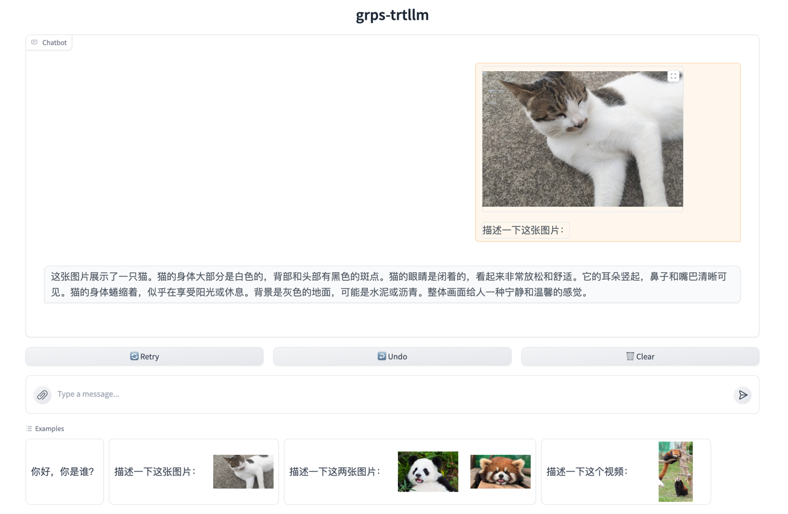

# 启动gradio服务

通过[gradio](https://www.gradio.app/)我们可以快速启动一个与LLM进行聊天的web界面，支持启动纯文本聊天界面和多模态聊天界面两种。如下启动命令：

```bash
# 安装gradio
pip install -r tools/gradio/requirements.txt

# 启动纯文本聊天界面，llm代表纯文本聊天，0.0.0.0:9997表示llm后端服务地址
python3 tools/gradio/llm_app.py llm 0.0.0.0:9997

# 启动多模态聊天界面，使用internvl2多模态模型，支持视频输入，由于显存限制，视频默认只截取了8帧，且可能不支持比较大的分别率，可以根据实际情况进行调整。
python3 tools/gradio/llm_app.py internvl2 0.0.0.0:9997

# 启动多模态聊天界面，使用qwenvl多模态模型，支持输出检测框
python3 tools/gradio/llm_app.py qwenvl 0.0.0.0:9997

# 启动多模态聊天界面，使用qwen2vl多模态模型
python3 tools/gradio/llm_app.py qwen2vl 0.0.0.0:9997

# 启动纯文本聊天界面，deepseek-r1支持CoT过程的纯文本聊天，0.0.0.0:9997表示llm后端服务地址
python3 tools/gradio/llm_app.py deepseek-r1 0.0.0.0:9997
```

启动后日志会显示服务端口号，默认为7860如下：

```bash
Running on local URL:  http://0.0.0.0:7860
```

通过浏览器访问```http://ip:7860```即可进入聊天界面。如下图：

