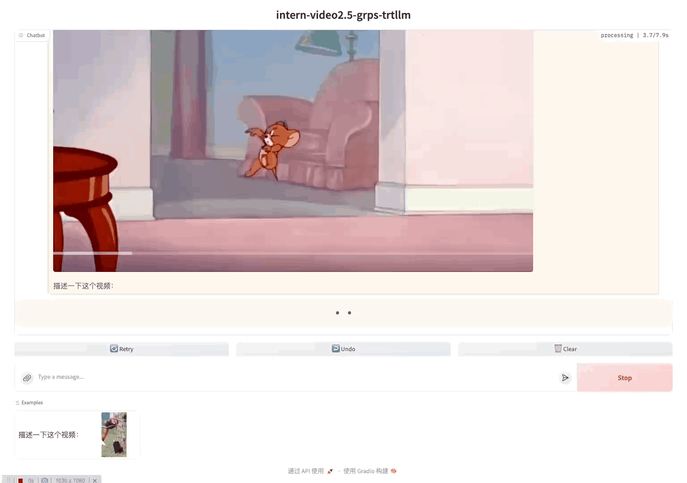

# InternVideo2.5

InternVideo2_5_Chat_8B模型的部署样例。视频vit部分无法完整转为tensorrt，目前视频vit使用grps
py自定义工程实现，grps-trtllm通过rpc进行远程调用计算视频的embeddings。

## 演示



## 开发环境

见[快速开始](../README.md#快速开始)
的拉取代码和创建容器部分。注意这里因为将grps-py功能打开，所以重新构建了registry.cn-hangzhou.aliyuncs.com/opengrps/grps_gpu:
grps1.1.0_cuda12.6_cudnn9.6_trtllm0.16.0_py3.12镜像，如果之前拉取的需要重新拉取。

## 构建trtllm引擎

```bash
# 下载InternVideo2_5_Chat_8B模型
apt update && apt install git-lfs
git lfs install
git clone https://huggingface.co/OpenGVLab/InternVideo2_5_Chat_8B /tmp/InternVideo2_5_Chat_8B

# 安装依赖
pip install -r ./tools/intern-video2.5/requirements.txt

# 转换ckpt，这里使用了int8 weight only量化减少显存占用
rm -rf /tmp/InternVideo2_5_Chat_8B/tllm_checkpoint/
python3 tools/intern-video2.5/convert_internlm2_ckpt.py --model_dir /tmp/InternVideo2_5_Chat_8B/ \
--use_weight_only --weight_only_precision int8 \
--output_dir /tmp/InternVideo2_5_Chat_8B/tllm_checkpoint/ --dtype bfloat16

# 构建llm引擎，根据具体显存情况可以配置不同。
# 这里设置支持最大batch_size为2，即支持2个并发同时推理，超过两个排队处理。
# 设置每个请求最多输入128个图片patch（InternVideo2.5中每个图片根据不同的尺寸最多产生1个patch，默认截取128帧），
# 即：max_multimodal_len=2（max_batch_size） * 128（图片最多产生patch个数） * 16（每个patch对应16个token） = 4096
# 设置max_input_len为6k，max_seq_len为8k（即最大输出为2k）。
rm -rf /tmp/InternVideo2_5_Chat_8B/trt_engines/
trtllm-build --checkpoint_dir /tmp/InternVideo2_5_Chat_8B/tllm_checkpoint/ \
--output_dir /tmp/InternVideo2_5_Chat_8B/trt_engines/ \
--gemm_plugin bfloat16 --max_batch_size 2 --paged_kv_cache enable \
--max_input_len 6144 --max_seq_len 8192 --max_num_tokens 6144 --max_multimodal_len 4096
```

## 构建与部署

```bash
# 进入视频vit服务目录
cd processors/intern-video2.5/
# 构建视频vit grps服务
grpst archive .
# 启动视频vit grps服务
grpst start ./server.mar --name intern-video2.5-processor
# 返回grps-trtllm根目录
cd ../../

# 构建grps-trtllm服务
grpst archive .
# 部署，
# 通过--inference_conf参数指定模型对应的inference.yml配置文件启动服务。
# 如需修改服务端口，并发限制等，可以修改conf/server.yml文件，然后启动时指定--server_conf参数指定新的server.yml文件。
# 注意如果使用多卡推理，需要使用mpi方式启动，--mpi_np参数为并行推理的GPU数量。
grpst start ./server.mar --inference_conf=conf/inference_intern-video2.5-chat-8B.yml

# 查看服务状态
grpst ps
# 可以看到两个grps服务
PORT(HTTP,RPC)      NAME                PID                 DEPLOY_PATH
9997                my_grps             1039424             /root/.grps/my_grps
7080,7081           intern-video2.5-proc1038099             /root/.grps/intern-video2.5-processor
```

## 配置说明

vit服务[inference.yml](../processors/intern-video2.5/conf/inference.yml) 部分关键配置：

```yaml
device: cuda:0 # 使用的GPU设备。
inferer_path: /tmp/InternVideo2_5_Chat_8B # llm模型路径，用于加载视频vit模型。
inferer_args:
  dtype: bfloat16  # 模型输入输出数据类型，可以是`float16`, `bfloat16`。
converter_args:
  shm_size: 536870912 # (512M), 共享内存大小，用于图像embeddings传输。
  shm_cnt: 2 # 共享内存申请个数。
  shm_name_prefix: "/intern-video2.5-sm" # 共享内存名称前缀。
```

vit服务[server.yml](../processors/intern-video2.5/conf/server.yml) 部分关键配置：

```yaml
max_concurrency: 1 # 最大并发数，即最大同时处理请求数。
```

grps-trtllm服务[inference_intern-video2.5-chat-8B.yml](../conf/inference_intern-video2.5-chat-8B.yml) 部分关键配置：

```yaml
vit_processor_args:
  host: 0.0.0.0 # 远程vit服务地址。
  port: 7081 # 远程vit服务端口。
  timeout_ms: 3000 # 远程vit服务超时时间
  dtype: bfloat16 # vit模型输入输出数据类型，可以是`float16`, `bfloat16`。
  max_frames: 80 # vit截取最大帧数。
  shm_size: 536870912 # (512M), 共享内存大小，用于图像embeddings传输。
```

* 为了避免视频embeddings进程间传输占用大量耗时，这里使用了共享内存技术，可以通过`shm_size`和`shm_cnt`配置共享内存大小和个数。
  `shm_cnt`限制共享内存申请个数，并发请求会通过加锁方式使用这些共享内存。
* 由于显存限制，这里限制了视频产生的最大帧数为80帧，可以根据显存情况调整`max_frames`。
* 由于显存限制，这里限制了视频vit最大并发数为1，可以根据显存情况调整`max_concurrency`。
* 视频vit可以单独放到其他显卡上，可以通过vit服务的`device`配置指定显卡，这里使用了`cuda:0`。

## 模拟请求

```bash
# 测试本地一段视频
cp ./tools/gradio/data/red-panda.mp4 /tmp/InternVideo2_5_Chat_8B/red-panda.mp4
curl --no-buffer http://127.0.0.1:9997/v1/chat/completions \
  -H "Content-Type: application/json" \
  -d '{
    "model": "InternVideo2_5",
    "messages": [
      {
        "role": "user",
        "content": [
          {
            "type": "text",
            "text": "详细描述一下这个视频的内容。"
          },
          {
            "type": "video_url",
            "video_url": {
              "url": "file:///tmp/InternVideo2_5_Chat_8B/red-panda.mp4"
            }
          }
        ]
      }
    ],
    "max_tokens": 256
  }'
# 返回如下：
: '
{
 "id": "chatcmpl-1",
 "object": "chat.completion",
 "created": 1740735222,
 "model": "InternVideo2_5",
 "system_fingerprint": "grps-trtllm-server",
 "choices": [
  {
   "index": 0,
   "message": {
    "role": "assistant",
    "content": "视频中出现了两只红熊猫，一只在树枝上，另一只站在地面上。树枝上红熊猫正在啃食挂在绳子上的食物，而地面上的红熊猫则试图用前爪抓住食物。两只红熊猫都拥有典型的红棕色皮毛，白色的面部和黑色的眼圈。它们看起来非常活泼好动，并且对食物表现出浓厚的兴趣。背景是一个户外环境，有绿色的草地和树木，以及一些模糊的围栏。视频风格自然，光线充足且均匀，没有特殊的光影效果。视频中没有其他物体或角色出现。"
   },
   "logprobs": null,
   "finish_reason": "stop"
  }
 ],
 "usage": {
  "prompt_tokens": 1894,
  "completion_tokens": 117,
  "total_tokens": 2011
 }
}
'
```

## 开启gradio服务

```bash
# 安装gradio
pip install -r tools/gradio/requirements.txt

# 启动多模态聊天界面，使用intern-video2.5多模态模型，0.0.0.0:9997表示llm后端服务地址
python3 tools/gradio/llm_app.py intern-video2.5 0.0.0.0:9997
```

## 关闭服务

```bash
# 关闭服务trtllm服务
grpst stop my_grps
# 关闭视频vit服务
grpst stop intern-video2.5-processor
```
