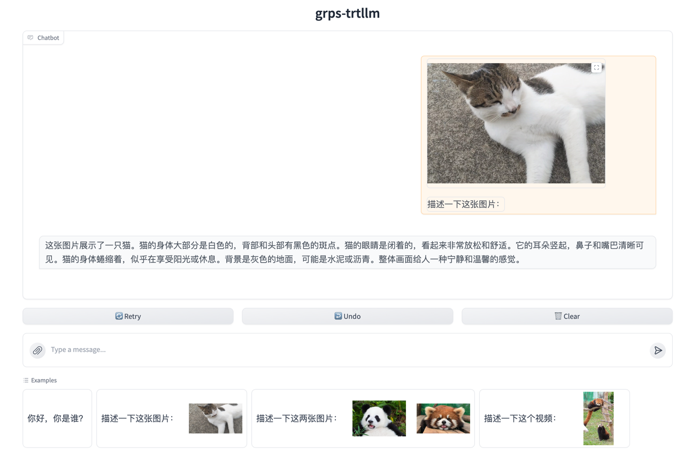

# InternVL3

InternVL3多模æ€LLM模å‹çš„部署示例（暂ä¸æ”¯æŒInternVL3-9B）。具体ä¸åŒå°ºå¯¸çš„vitå’Œllm组åˆå¦‚下表格：

|  Model Name   |                                       Vision Part                                       |                                 Language Part                                  |                          HF Link                          |
|:-------------:|:---------------------------------------------------------------------------------------:|:------------------------------------------------------------------------------:|:---------------------------------------------------------:|
| InternVL3-1B  | [InternViT-300M-448px-V2_5](https://huggingface.co/OpenGVLab/InternViT-300M-448px-V2_5) |            [Qwen2.5-0.5B](https://huggingface.co/Qwen/Qwen2.5-0.5B)            | [🤗 link](https://huggingface.co/OpenGVLab/InternVL3-1B)  |
| InternVL3-2B  | [InternViT-300M-448px-V2_5](https://huggingface.co/OpenGVLab/InternViT-300M-448px-V2_5) |            [Qwen2.5-1.5B](https://huggingface.co/Qwen/Qwen2.5-1.5B)            | [🤗 link](https://huggingface.co/OpenGVLab/InternVL3-2B)  |
| InternVL3-8B  | [InternViT-300M-448px-V2_5](https://huggingface.co/OpenGVLab/InternViT-300M-448px-V2_5) |              [Qwen2.5-7B](https://huggingface.co/Qwen/Qwen2.5-7B)              | [🤗 link](https://huggingface.co/OpenGVLab/InternVL3-8B)  |
| InternVL3-9B  | [InternViT-300M-448px-V2_5](https://huggingface.co/OpenGVLab/InternViT-300M-448px-V2_5) | [internlm3-8b-instruct](https://huggingface.co/internlm/internlm3-8b-instruct) | [🤗 link](https://huggingface.co/OpenGVLab/InternVL3-9B)  |
| InternVL3-14B | [InternViT-300M-448px-V2_5](https://huggingface.co/OpenGVLab/InternViT-300M-448px-V2_5) |             [Qwen2.5-14B](https://huggingface.co/Qwen/Qwen2.5-14B)             | [🤗 link](https://huggingface.co/OpenGVLab/InternVL3-14B) |
| InternVL3-38B |   [InternViT-6B-448px-V2_5](https://huggingface.co/OpenGVLab/InternViT-6B-448px-V2_5)   |             [Qwen2.5-32B](https://huggingface.co/Qwen/Qwen2.5-32B)             | [🤗 link](https://huggingface.co/OpenGVLab/InternVL3-38B) |
| InternVL3-78B |   [InternViT-6B-448px-V2_5](https://huggingface.co/OpenGVLab/InternViT-6B-448px-V2_5)   |             [Qwen2.5-72B](https://huggingface.co/Qwen/Qwen2.5-72B)             | [🤗 link](https://huggingface.co/OpenGVLab/InternVL3-78B) |

## 演示


## å¼€å‘ç¯å¢ƒ

è§[快速开始](../README.md#快速开始)的拉å–代ç å’Œåˆ›å»ºå®¹å™¨éƒ¨åˆ†ã€‚

## æ„建trtllm引æ“

### 1B\2B\8B\14B\38B\78B

以InternVL3-8B模å‹ä¸ºä¾‹ï¼Œå…¶ä»–模å‹ç±»ä¼¼ã€‚

```bash
# 下载InternVL3-8B模å‹
apt update && apt install git-lfs
git lfs install
git clone https://huggingface.co/OpenGVLab/InternVL3-8B /tmp/InternVL3-8B

# 安装ä¾èµ–
pip install -r ./tools/internvl2/requirements.txt

# 转æ¢ckpt
rm -rf /tmp/InternVL3-8B/tllm_checkpoint/
python3 tools/internvl2/convert_qwen2_ckpt.py --model_dir /tmp/InternVL3-8B/ \
--output_dir /tmp/InternVL3-8B/tllm_checkpoint/ --dtype bfloat16

# æ„建llm引æ“，根æ®å…·ä½“显存情况å¯ä»¥é…ç½®ä¸åŒã€‚
# 这里设置支æŒæœ€å¤§batch_size为2，å³æ”¯æŒ2个并å‘åŒæ—¶æ¨ç†ï¼Œè¶…过两个æ’队处ç†ã€‚
# 设置æ¯ä¸ªè¯·æ±‚最多输入26个图片patch（InternVL2.5中æ¯ä¸ªå›¾ç‰‡æ ¹æ®ä¸åŒçš„尺寸最多产生13个patch）。
# å³ï¼šmax_multimodal_len=4（max_batch_size） * 26（图片最多产生patch个数） * 256（æ¯ä¸ªpatch对应256个token） = 26624
# 设置max_input_len为30k，max_seq_len为32k（å³é»˜è®¤æœ€å¤§è¾“出为2k）。
rm -rf /tmp/InternVL3-8B/trt_engines/
trtllm-build --checkpoint_dir /tmp/InternVL3-8B/tllm_checkpoint/ \
--output_dir /tmp/InternVL3-8B/trt_engines/ \
--gemm_plugin bfloat16 --max_batch_size 4 --paged_kv_cache enable --use_paged_context_fmha enable \
--max_input_len 30720 --max_seq_len 32768 --max_num_tokens 32768 --max_multimodal_len 26624

# æ„建vit引æ“，设置--maxBS为26å¯ä»¥åŒæ—¶å¤„ç†26个图片patch（InternVL2.5中æ¯ä¸ªå›¾ç‰‡æ ¹æ®ä¸åŒçš„尺寸最多产生13个patch）。
python3 tools/internvl2/build_vit_engine.py --pretrainedModelPath /tmp/InternVL3-8B \
--imagePath ./data/frames/frame_0.jpg \
--onnxFile /tmp/InternVL3-8B/vision_encoder_bfp16.onnx \
--trtFile /tmp/InternVL3-8B/vision_encoder_bfp16.trt \
--dtype bfloat16 --minBS 1 --optBS 13 --maxBS 26
```

### 9B

æš‚ä¸æ”¯æŒ

## æ„建ä¸éƒ¨ç½²

```bash
# æ„建
grpst archive .

# 部署，
# 通过--inference_confå‚数指定模å‹å¯¹åº”çš„inference.ymlé…置文件å¯åŠ¨æœåŠ¡ã€‚
# 如需修改æœåŠ¡ç«¯å£ï¼Œå¹¶å‘é™åˆ¶ç­‰ï¼Œå¯ä»¥ä¿®æ”¹conf/server.yml文件，然åå¯åŠ¨æ—¶æŒ‡å®š--server_confå‚数指定新的server.yml文件。
# 注æ„如æœä½¿ç”¨å¤šå¡æ¨ç†ï¼Œéœ€è¦ä½¿ç”¨mpiæ–¹å¼å¯åŠ¨ï¼Œ--mpi_npå‚数为并行æ¨ç†çš„GPUæ•°é‡ã€‚
grpst start ./server.mar --inference_conf=conf/inference_internvl3.yml

# 查看æœåŠ¡çŠ¶æ€
grpst ps
# 如下输出
PORT(HTTP,RPC)      NAME                PID                 DEPLOY_PATH         
9997                my_grps             65322               /home/appops/.grps/my_grps
```

## 模拟请求

```bash
# 测试本地一张图片
curl --no-buffer http://127.0.0.1:9997/v1/chat/completions \
  -H "Content-Type: application/json" \
  -d '{
    "model": "InternVL3",
    "messages": [
      {
        "role": "user",
        "content": [
          {
            "type": "text",
            "text": "<image>\n简述一下这张图片的内容。"
          },
          {
            "type": "image_url",
            "image_url": {
              "url": "file:///tmp/InternVL3-8B/examples/image1.jpg"
            }
          }
        ]
      }
    ],
    "max_tokens": 256
  }'
# è¿”å›å¦‚下：
: '
{
 "id": "chatcmpl-1",
 "object": "chat.completion",
 "created": 1744862005,
 "model": "InternVL2_5",
 "system_fingerprint": "grps-trtllm-server",
 "choices": [
  {
   "index": 0,
   "message": {
    "role": "assistant",
    "content": "这是一张红熊猫的照片。红熊猫毛色为红è¤è‰²ï¼Œè„¸å’Œè€³æœµå‘¨å›´æœ‰ç™½è‰²ï¼Œé¼»å­ä¸ºé»‘色，显得é常å¯çˆ±ã€‚背景看上å»åƒæ˜¯åœ¨æˆ·å¤–，有绿色的树木。红熊猫正趴在木制的结æ„上，看起æ¥å¾ˆæ”¾æ¾ã€‚"
   },
   "logprobs": null,
   "finish_reason": "stop"
  }
 ],
 "usage": {
  "prompt_tokens": 3383,
  "completion_tokens": 56,
  "total_tokens": 3439
 }
}
'

# 测试通过httpsä»ç½‘络上下载的一张图片，解读其中的文字内容
curl --no-buffer http://127.0.0.1:9997/v1/chat/completions \
  -H "Content-Type: application/json" \
  -d '{
    "model": "InternVL3",
    "messages": [
      {
        "role": "user",
        "content": [
          {
            "type": "text",
            "text": "<image>\n简述一下这张图片的内容。"
          },
          {
            "type": "image_url",
            "image_url": {
              "url": "https://pic3.zhimg.com/v2-5904ffb96cf191bde40b91e4b7804d92_r.jpg"
            }
          }
        ]
      }
    ],
    "max_tokens": 1024
  }'
# è¿”å›å¦‚下：
: '
{
 "id": "chatcmpl-2",
 "object": "chat.completion",
 "created": 1744862028,
 "model": "InternVL2_5",
 "system_fingerprint": "grps-trtllm-server",
 "choices": [
  {
   "index": 0,
   "message": {
    "role": "assistant",
    "content": "这是一张æ¯æ—¥æ–°é—»ç®€æŠ¥çš„图片。标题为“星期六â€ï¼ŒèƒŒæ™¯ä¸ºè“色，é…有激励的è¯ï¼šâ€œçŸ­çŸ­çš„一生，我们最终都会失å»ï¼Œä½ ä¸å¦¨å¤§èƒ†ä¸€äº›ã€‚爱一个人，攀一座山，追一个梦。â€æ­£æ–‡éƒ¨åˆ†åˆ†ä¸ºä¸¤å¤§éƒ¨åˆ†ï¼š\n\n1. **早安读世界 今日简报 Good Morning**：\n   - 日期和日å†ä¿¡æ¯ï¼šâ€œ2024å¹´3月23日，星期六，农å†äºŒæœˆå四，早安ï¼â€\n   - 共有15æ¡æ–°é—»ï¼Œæ¶µç›–了ä¸åŒå›½å®¶å’Œåœ°åŒºçš„主è¦æ–°é—»ï¼š\n     1. 3·15雅江森æ—ç«ç¾èµ·å› ï¼ˆç”±æ–½å·¥å¼•å‘）。\n     2. 对未æˆå¹´äººæ•…æ„æ€äººä¸¥é‡çŠ¯ç½ªè¿½ç©¶åˆ‘责。\n     3. 游æ—网络董事长致毒æ€æ¡ˆåˆ¤å†³ã€‚\n     4. 武汉地é“对无臂男å­å…费乘车é“歉事件。\n     5. 中国首个无人驾驶电动å‚ç›´èµ·é™èˆªç©ºå™¨è·å‡†åˆæ ¼è¯ã€‚\n     6. 中国网民数é‡10.92亿，互è”网普åŠç‡è¾¾77.5%。\n     7. 国家æ—è‰å±€æ¶ˆæ¯ï¼šä¸­å›½æ£®æ—资æºå¢é•¿æœ€å¿«ã€‚\n     8. 郑å·è´­è½¦è¡¥è´´æ´»åŠ¨ï¼šæ–°èƒ½æºæ¯å°è¡¥è´´ä¸è¶…过5000元。\n     9. 国å°åŠé€šæŠ¥ç¦å»ºæµ·è­¦æ•‘起的两å渔民。\n     10. 甘肃天水麻椒ç«é”…圈ç«ã€‚\n     11. 加拿大æè®®å‡å°‘临时居留人数。\n     12. 以色列宣布没收并归还土地。\n     13. ç¾å›½æˆåŠŸç§»æ¤çŒ´è‚¾ã€‚\n     14. ç¾å›½è¾¹å¢ƒé法移民事件。\n     15. 俄罗斯对乌克兰å‘动无人机和导弹袭击。\n\n2. **底部的标识**：“早安读世界â€ã€‚\n\n这些新闻简è¦æ¦‚括了全çƒä¸åŒåœ°åŒºçš„最新é‡å¤§äº‹ä»¶ã€‚"
   },
   "logprobs": null,
   "finish_reason": "stop"
  }
 ],
 "usage": {
  "prompt_tokens": 3383,
  "completion_tokens": 402,
  "total_tokens": 3785
 }
}
'

# 测试输入两张图片
curl --no-buffer http://127.0.0.1:9997/v1/chat/completions \
  -H "Content-Type: application/json" \
  -d '{
    "model": "InternVL3",
    "messages": [
      {
        "role": "user",
        "content": [
          {
            "type": "text",
            "text": "Image-1: <image>\nImage-2: <image>\næ述一下两张图片的ä¸åŒã€‚"
          },
          {
            "type": "image_url",
            "image_url": {
              "url": "file:///tmp/InternVL3-8B/examples/image1.jpg"
            }
          },
          {
            "type": "image_url",
            "image_url": {
              "url": "file:///tmp/InternVL3-8B/examples/image2.jpg"
            }
          }
        ]
      }
    ],
    "max_tokens": 256
  }'
# è¿”å›å¦‚下：
: '
{
 "id": "chatcmpl-4",
 "object": "chat.completion",
 "created": 1744862213,
 "model": "InternVL3",
 "system_fingerprint": "grps-trtllm-server",
 "choices": [
  {
   "index": 0,
   "message": {
    "role": "assistant",
    "content": "Image-1: 图片中是一åªçº¢ç†ŠçŒ«ï¼Œå®ƒæ­£è¶´åœ¨æœ¨åˆ¶ç»“æ„上，背景是绿色的树å¶å’Œæ ‘干。红熊猫具有独特的红è¤è‰²å’Œç™½è‰²ç›¸é—´çš„毛å‘，脸部有白色的æ¡çº¹ï¼Œè€³æœµä¸Šæœ‰æ˜æ˜¾çš„白色尖端。\n\nImage-2: 图片中是一åªå¤§ç†ŠçŒ«ï¼Œæ­£ç”¨å‰çˆªæŠ“ç€ç«¹å¶åƒã€‚大熊猫ä½äºèŒ‚密的竹æ—中，周围有绿色的竹å­å’Œæ¤ç‰©ï¼Œåœ°é¢æ•£è½ç€ä¸€äº›ç«¹å¶å’Œç«¹æ。背景中éšçº¦å¯è§å¦ä¸€åªå¤§ç†ŠçŒ«çš„一部分身影，整体ç¯å¢ƒçœ‹èµ·æ¥æ˜¯ä¸€ä¸ªè‡ªç„¶çš„æ –æ¯åœ°æˆ–动物园的ä¿æŠ¤åŒºã€‚"
   },
   "logprobs": null,
   "finish_reason": "stop"
  }
 ],
 "usage": {
  "prompt_tokens": 5955,
  "completion_tokens": 130,
  "total_tokens": 6085
 }
}
'

# 测试多轮对è¯
curl --no-buffer http://127.0.0.1:9997/v1/chat/completions \
  -H "Content-Type: application/json" \
  -d '{
    "model": "InternVL3",
    "messages": [
      {
        "role": "user",
        "content": [
          {
            "type": "text",
            "text": "Image-1: <image>\nImage-2: <image>\næ述一下两张图片的ä¸åŒã€‚"
          },
          {
            "type": "image_url",
            "image_url": {
              "url": "file:///tmp/InternVL3-8B/examples/image1.jpg"
            }
          },
          {
            "type": "image_url",
            "image_url": {
              "url": "file:///tmp/InternVL3-8B/examples/image2.jpg"
            }
          }
        ]
      },
      {
        "role": "assistant",
        "content": "Image-1: 图片中是一åªçº¢ç†ŠçŒ«ï¼Œå®ƒæ­£è¶´åœ¨æœ¨åˆ¶ç»“æ„上，背景是绿色的树å¶å’Œæ ‘干。红熊猫具有独特的红è¤è‰²å’Œç™½è‰²ç›¸é—´çš„毛å‘，脸部有白色的æ¡çº¹ï¼Œè€³æœµä¸Šæœ‰æ˜æ˜¾çš„白色尖端。\n\nImage-2: 图片中是一åªå¤§ç†ŠçŒ«ï¼Œæ­£ç”¨å‰çˆªæŠ“ç€ç«¹å¶åƒã€‚大熊猫ä½äºèŒ‚密的竹æ—中，周围有绿色的竹å­å’Œæ¤ç‰©ï¼Œåœ°é¢æ•£è½ç€ä¸€äº›ç«¹å¶å’Œç«¹æ。背景中éšçº¦å¯è§å¦ä¸€åªå¤§ç†ŠçŒ«çš„一部分身影，整体ç¯å¢ƒçœ‹èµ·æ¥æ˜¯ä¸€ä¸ªè‡ªç„¶çš„æ –æ¯åœ°æˆ–动物园的ä¿æŠ¤åŒºã€‚"
      },
      {
        "role": "user",
        "content": "æ述一下图片-2中的熊猫所在的ç¯å¢ƒã€‚"
      }
    ],
    "max_tokens": 256
  }'
# è¿”å›å¦‚下：
: '
{
 "id": "chatcmpl-5",
 "object": "chat.completion",
 "created": 1744862291,
 "model": "InternVL3",
 "system_fingerprint": "grps-trtllm-server",
 "choices": [
  {
   "index": 0,
   "message": {
    "role": "assistant",
    "content": "图片-2中的熊猫ä½äºä¸€ä¸ªç«¹æ—ç¯å¢ƒä¸­ï¼Œå‘¨å›´æœ‰è®¸å¤šç»¿è‰²çš„竹å­å’Œæ¤ç‰©ã€‚熊猫å在地é¢ä¸Šï¼ŒèƒŒæ™¯ä¸­å¯ä»¥è§åˆ°ä¸€äº›çŸ³å—和木结æ„，å¯èƒ½æ˜¯ä¸€ä¸ªæ –æ¯åœ°çš„å›´æ æˆ–木桩。竹å­ç¹èŒ‚，覆盖了大部分地é¢ï¼Œè¥é€ å‡ºä¸€ç§è‡ªç„¶ä¸”éšç§˜çš„氛围，适åˆç†ŠçŒ«ç”Ÿæ´»å’Œè§…食。"
   },
   "logprobs": null,
   "finish_reason": "stop"
  }
 ],
 "usage": {
  "prompt_tokens": 6104,
  "completion_tokens": 76,
  "total_tokens": 6180
 }
}
'

# 通过openai api进行请求
python3 client/openai_cli.py 0.0.0.0:9997 "<image>\n简述一下这张图片的内容。" false "https://i2.hdslb.com/bfs/archive/7172d7a46e2703e0bd5eabda22f8d8ac70025c76.jpg"
# è¿”å›å¦‚下：
: '
ChatCompletion(id='chatcmpl-7', choices=[Choice(finish_reason='stop', index=0, logprobs=None, message=ChatCompletionMessage(content='这张图片展示了一åªèººåœ¨åœ°ä¸Šçš„猫。猫的毛色主è¦æ˜¯ç™½è‰²ï¼Œå¹¶ä¸”背部有棕色和黑色的斑点。它看起æ¥å¾ˆæ”¾æ¾ï¼Œçœ¼ç›åŠé—­ç€ï¼Œä¼¼ä¹åœ¨äº«å—阳光或åªæ˜¯åœ¨ä¼‘æ¯ã€‚猫的姿势很悠闲，四肢舒展，头微微侧å‘一边，给人一ç§é常惬æ„的感觉。背景是粗糙的水泥地é¢ã€‚', refusal=None, role='assistant', function_call=None, tool_calls=None))], created=1744862414, model='', object='chat.completion', service_tier=None, system_fingerprint='grps-trtllm-server', usage=CompletionUsage(completion_tokens=75, prompt_tokens=2359, total_tokens=2434))
'

# 通过base64 img urlæ–¹å¼è¿›è¡Œè¯·æ±‚
python3 client/base64_img_cli.py 0.0.0.0:9997 "<image>\n简述一下这张图片的内容。" false ./data/image1.jpg
# è¿”å›å¦‚下：
: '
ChatCompletion(id='chatcmpl-8', choices=[Choice(finish_reason='stop', index=0, logprobs=None, message=ChatCompletionMessage(content='这张图片展示了一åªå¯çˆ±çš„å°ç†ŠçŒ«ï¼Œä¹Ÿå«çº¢ç†ŠçŒ«ã€‚å°ç†ŠçŒ«çš„毛色是典å‹çš„红è¤è‰²å’Œç™½è‰²ç›¸é—´ï¼Œè€³æœµå†…侧和脸部的毛å‘是白色的，而耳朵的外侧是红è¤è‰²ã€‚它正趴在木æ¿ä¸Šï¼Œç¥æƒ…显得很悠闲和好奇，背景是绿色的树å¶å’Œæ ‘干。红熊猫生活在树上，擅长攀爬，主è¦åˆ†å¸ƒåœ¨ä¸­å›½è¥¿å—部ã€ä¸ä¸¹ã€å°¼æ³Šå°”å’Œå°åº¦åŒ—部的森æ—中。', refusal=None, role='assistant', function_call=None, tool_calls=None))], created=1744862433, model='', object='chat.completion', service_tier=None, system_fingerprint='grps-trtllm-server', usage=CompletionUsage(completion_tokens=101, prompt_tokens=3383, total_tokens=3484))
’
```

## å¼€å¯gradioæœåŠ¡



```bash
# 安装gradio
pip install -r tools/gradio/requirements.txt

# å¯åŠ¨å¤šæ¨¡æ€èŠå¤©ç•Œé¢ï¼Œä½¿ç”¨internvl3多模æ€æ¨¡å‹ï¼Œ0.0.0.0:9997表示llmå端æœåŠ¡åœ°å€
python3 tools/gradio/llm_app.py internvl3 0.0.0.0:9997
```

## 关闭æœåŠ¡

```bash
# 关闭æœåŠ¡
grpst stop my_grps
```
