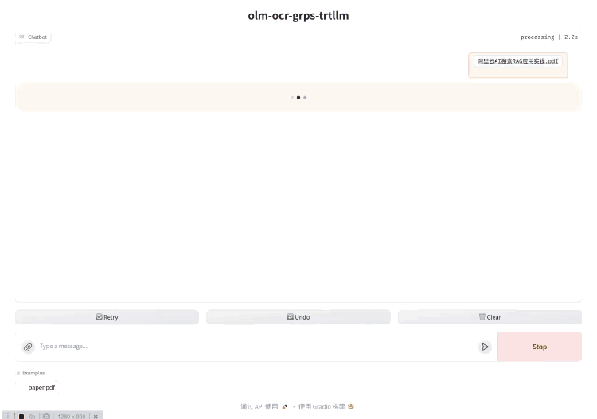

# olmOCR-7B-0225-preview

olmOCR-7B-0225-preview模型的部署示例。

## 演示



## 开发环境

见[快速开始](../README.md#快速开始)的拉取代码和创建容器部分。

## 构建trtllm引擎

### olmOCR-7B-0225-preview

```bash
# 下载olmOCR-7B-0225-preview模型
apt update && apt install git-lfs
git lfs install
git clone https://huggingface.co/allenai/olmOCR-7B-0225-preview /tmp/olmOCR-7B-0225-preview

# 安装依赖
apt update
apt-get install poppler-utils ttf-mscorefonts-installer msttcorefonts fonts-crosextra-caladea fonts-crosextra-carlito gsfonts lcdf-typetools
pip install git+https://github.com/huggingface/transformers@21fac7abba2a37fae86106f87fcf9974fd1e3830 accelerate
pip install qwen-vl-utils pycuda==2024.1.2 olmocr

# 转换ckpt，使用int8 weight only量化减少显存占用
rm -rf /tmp/olmOCR-7B-0225-preview/tllm_checkpoint/
python3 ./third_party/TensorRT-LLM/examples/qwen/convert_checkpoint.py \
--model_dir /tmp/olmOCR-7B-0225-preview/ \
--output_dir /tmp/olmOCR-7B-0225-preview/tllm_checkpoint/ \
--use_weight_only --weight_only_precision int8 \
--dtype bfloat16 --load_model_on_cpu

# 构建llm引擎，根据具体显存情况可以配置不同。
# 这里设置支持最大batch_size为4，即支持4个并发同时推理，超过4个排队处理。
rm -rf /tmp/olmOCR-7B-0225-preview/trt_engines
trtllm-build --checkpoint_dir /tmp/olmOCR-7B-0225-preview//tllm_checkpoint/ \
--output_dir /tmp/olmOCR-7B-0225-preview/trt_engines \
--gemm_plugin=bfloat16 \
--gpt_attention_plugin=bfloat16 \
--max_batch_size=4 \
--max_input_len=30720 --max_seq_len=32768 \
--max_num_tokens 32768 \
--max_prompt_embedding_table_size=28416

# 构建vit引擎
python3 tools/qwen2vl/build_vit_engine.py --pretrainedModelPath /tmp/olmOCR-7B-0225-preview/ \
--onnxFile /tmp/olmOCR-7B-0225-preview/vision_encoder_bfp16.onnx \
--mropeOnnxFile /tmp/olmOCR-7B-0225-preview/mrope_only_bfp16.onnx \
--dtype bfloat16 --cvtOnnx
python3 tools/qwen2vl/build_vit_engine.py --pretrainedModelPath /tmp/olmOCR-7B-0225-preview/ \
--onnxFile /tmp/olmOCR-7B-0225-preview/vision_encoder_bfp16.onnx \
--trtFile /tmp/olmOCR-7B-0225-preview/vision_encoder_bfp16.trt \
--mropeOnnxFile /tmp/olmOCR-7B-0225-preview/mrope_only_bfp16.onnx \
--mropeTrtFile /tmp/olmOCR-7B-0225-preview/mrope_only_bfp16.trt \
--dtype bfloat16 --minBS 1 --optBS 1 --maxBS 8 --cvtTrt
```

## 构建与部署

```bash
# 构建
grpst archive .

# 部署，
# 通过--inference_conf参数指定模型对应的inference.yml配置文件启动服务。
# 如需修改服务端口，并发限制等，可以修改conf/server.yml文件，然后启动时指定--server_conf参数指定新的server.yml文件。
# 注意如果使用多卡推理，需要使用mpi方式启动，--mpi_np参数为并行推理的GPU数量。
grpst start ./server.mar --inference_conf=conf/inference_olm_ocr.yml

# 查看服务状态
grpst ps
# 如下输出
PORT(HTTP,RPC)      NAME                PID                 DEPLOY_PATH         
9997                my_grps             65322               /home/appops/.grps/my_grps
```

## 模拟请求

```bash
python3 client/olm_ocr_cli.py 0.0.0.0:9997 https://molmo.allenai.org/paper.pdf 1
# 返回如下：
: '
prompt: Below is the image of one page of a document, as well as some raw textual content that was previously extracted for it. Just return the plain text representation of this document as if you were reading it naturally.
Do not hallucinate.
RAW_TEXT_START
Page dimensions: 612.0x792.0
[50x111]at
[50x123]lect model weights, inference code, and demo are available
[50x135]and fine-tuning data, and source code in the near future. Se-
[50x159]benchmarks and human evaluation
...

ChatCompletionChunk(id='chatcmpl-68', choices=[Choice(delta=ChoiceDelta(content='{"', function_call=None, refusal=None, role='assistant', tool_calls=None), finish_reason=None, index=0, logprobs=None)], created=1741094554, model='', object='chat.completion.chunk', service_tier=None, system_fingerprint='grps-trtllm-server', usage=None)
ChatCompletionChunk(id='chatcmpl-68', choices=[Choice(delta=ChoiceDelta(content='primary', function_call=None, refusal=None, role=None, tool_calls=None), finish_reason=None, index=0, logprobs=None)], created=1741094554, model='', object='chat.completion.chunk', service_tier=None, system_fingerprint='grps-trtllm-server', usage=None)
ChatCompletionChunk(id='chatcmpl-68', choices=[Choice(delta=ChoiceDelta(content='_language', function_call=None, refusal=None, role=None, tool_calls=None), finish_reason=None, index=0, logprobs=None)], created=1741094554, model='', object='chat.completion.chunk', service_tier=None, system_fingerprint='grps-trtllm-server', usage=None)
'
```

## 开启gradio服务

```bash
# 安装gradio
pip install -r tools/gradio/requirements.txt

# 启动多模态聊天界面，使用olm-ocr多模态模型，0.0.0.0:9997表示llm后端服务地址
python3 tools/gradio/llm_app.py olm-ocr 0.0.0.0:9997
```

## 关闭服务

```bash
# 关闭服务
grpst stop my_grps
```
