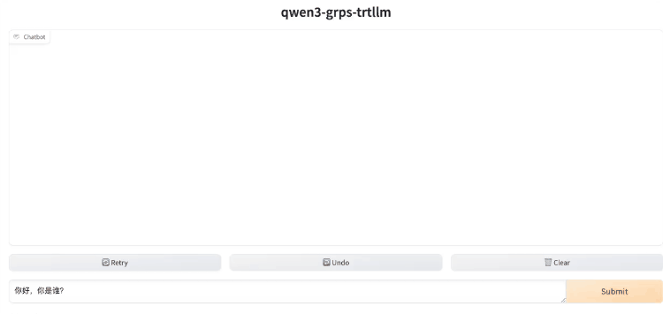

# Qwen3

Qwen3模型的部署示例，以Qwen3-8B为例。暂不支持Moe架构（Qwen3-30B-A3B、Qwen3-235B-A22B）。

## 演示



## 开发环境

见[快速开始](../README.md#快速开始)的拉取代码和创建容器部分。如果之前拉取过镜像，需要重新拉取一下使用新的镜像。新镜像增加了对Qwen3ForCausalLM的支持。

```bash
# 安装较新版本transformers与modelopt
pip install git+https://github.com/huggingface/transformers@v4.51.0
pip install nvidia-modelopt==0.27.0
```

## 构建trtllm引擎

```bash
# 下载Qwen3-8B模型
apt update && apt install git-lfs
git lfs install
git clone https://huggingface.co/Qwen/Qwen3-8B /tmp/Qwen3-8B

# 转换ckpt
rm -rf /tmp/Qwen3-8B/tllm_checkpoint/
python3 third_party/TensorRT-LLM/examples/qwen/convert_checkpoint.py --model_dir /tmp/Qwen3-8B \
--output_dir /tmp/Qwen3-8B/tllm_checkpoint/ --dtype bfloat16 --load_model_on_cpu

# 构建引擎
rm -rf /tmp/Qwen3-8B/trt_engines/
trtllm-build --checkpoint_dir /tmp/Qwen3-8B/tllm_checkpoint/ \
--output_dir /tmp/Qwen3-8B/trt_engines/ \
--gemm_plugin bfloat16 --max_batch_size 16 --paged_kv_cache enable --use_paged_context_fmha enable \
--max_input_len 32256 --max_seq_len 32768 --max_num_tokens 32256
# 运行测试
python3 third_party/TensorRT-LLM/examples/run.py --input_text "你好，你是谁？" --max_output_len=50 \
--tokenizer_dir /tmp/Qwen3-8B/ \
--engine_dir=/tmp/Qwen3-8B/trt_engines/
```

## 量化

通过[NVIDIA Modelopt toolkit](https://github.com/NVIDIA/TensorRT-LLM/blob/v0.16.0/examples/quantization/README.md)
支持int8/int4 weight-only、awq、smooth quant、fp8等量化。

### int8 weight-only量化

```bash
# 转换ckpt
rm -rf /tmp/Qwen3-8B/tllm_checkpoint/
python3 third_party/TensorRT-LLM/examples/quantization/quantize.py --model_dir /tmp/Qwen3-8B \
--dtype bfloat16 --qformat int8_wo \
--output_dir /tmp/Qwen3-8B/tllm_checkpoint/

# 构建引擎
rm -rf /tmp/Qwen3-8B/trt_engines/
trtllm-build --checkpoint_dir /tmp/Qwen3-8B/tllm_checkpoint/ \
--output_dir /tmp/Qwen3-8B/trt_engines/ \
--gemm_plugin bfloat16 --max_batch_size 16 --paged_kv_cache enable --use_paged_context_fmha enable \
--max_input_len 32256 --max_seq_len 32768 --max_num_tokens 32256
```

### int4-awq量化

```bash
# 使用Modelopt 转换 ckpt
rm -rf /tmp/Qwen3-8B/tllm_checkpoint/
python3 third_party/TensorRT-LLM/examples/quantization/quantize.py --model_dir /tmp/Qwen3-8B \
--dtype bfloat16 --qformat int4_awq --awq_block_size 128 \
--output_dir /tmp/Qwen3-8B/tllm_checkpoint/
# 构建引擎
rm -rf /tmp/Qwen3-8B/trt_engines/
trtllm-build --checkpoint_dir /tmp/Qwen3-8B/tllm_checkpoint/ \
--output_dir /tmp/Qwen3-8B/trt_engines/ \
--gemm_plugin bfloat16 --max_batch_size 16 --paged_kv_cache enable --use_paged_context_fmha enable \
--max_input_len 32256 --max_seq_len 32768 --max_num_tokens 32256

# 也可以直接使用huggingface的awq版本直接转换ckpt，例如Qwen3-14B-AWQ
git clone https://huggingface.co/Qwen/Qwen3-14B-AWQ /tmp/Qwen3-14B-AWQ
rm -rf /tmp/Qwen3-14B-AWQ/tllm_checkpoint/
python3 third_party/TensorRT-LLM/examples/qwen/convert_checkpoint.py --model_dir /tmp/Qwen3-14B-AWQ \
--output_dir /tmp/Qwen3-14B-AWQ/tllm_checkpoint/ --dtype bfloat16 --load_model_on_cpu
# 构建引擎
rm -rf /tmp/Qwen3-14B-AWQ/trt_engines/
trtllm-build --checkpoint_dir /tmp/Qwen3-14B-AWQ/tllm_checkpoint/ \
--output_dir /tmp/Qwen3-14B-AWQ/trt_engines/ \
--gemm_plugin bfloat16 --max_batch_size 16 --paged_kv_cache enable --use_paged_context_fmha enable \
--max_input_len 32256 --max_seq_len 32768 --max_num_tokens 32256
```

### fp8量化

需要硬件支持，否则会有如下报错：
```[TRT] [E] IBuilder::buildSerializedNetwork: Error Code 9: API Usage Error (Networks with FP8 Q/DQ layers require hardware with FP8 support.)```

```bash
# 转换ckpt
rm -rf /tmp/Qwen3-8B/tllm_checkpoint/
python3 third_party/TensorRT-LLM/examples/quantization/quantize.py --model_dir /tmp/Qwen3-8B \
--dtype bfloat16 --qformat fp8 --kv_cache_dtype fp8 --awq_block_size 128 \
--output_dir /tmp/Qwen3-8B/tllm_checkpoint/

# 构建引擎
rm -rf /tmp/Qwen3-8B/trt_engines/
trtllm-build --checkpoint_dir /tmp/Qwen3-8B/tllm_checkpoint/ \
--output_dir /tmp/Qwen3-8B/trt_engines/ \
--gemm_plugin bfloat16 --max_batch_size 16 --paged_kv_cache enable --use_paged_context_fmha enable \
--max_input_len 32256 --max_seq_len 32768 --max_num_tokens 32256
```

### smooth quant量化

```bash
# 转换ckpt
rm -rf /tmp/Qwen3-8B/tllm_checkpoint/
python3 third_party/TensorRT-LLM/examples/quantization/quantize.py --model_dir /tmp/Qwen3-8B \
--dtype bfloat16 --qformat int8_sq --kv_cache_dtype int8 --awq_block_size 128 \
--output_dir /tmp/Qwen3-8B/tllm_checkpoint/

# 构建引擎
rm -rf /tmp/Qwen3-8B/trt_engines/
trtllm-build --checkpoint_dir /tmp/Qwen3-8B/tllm_checkpoint/ \
--output_dir /tmp/Qwen3-8B/trt_engines/ \
--gemm_plugin bfloat16 --max_batch_size 16 --paged_kv_cache enable --use_paged_context_fmha enable \
--max_input_len 32256 --max_seq_len 32768 --max_num_tokens 32256
```

## 构建与部署

### enable_thinking

Qwen3支持thinking功能，默认开启。可以在[inference_qwen3.yml](../conf/inference_qwen3.yml)中修改`enable_thinking`
参数为false关闭，也可以在请求中通过`enable_thinking`参数关闭。

```bash
# 构建
grpst archive .

# 部署，
# 通过--inference_conf参数指定模型对应的inference.yml配置文件启动服务。
# 如需修改服务端口，并发限制等，可以修改conf/server.yml文件，然后启动时指定--server_conf参数指定新的server.yml文件。
# 注意如果使用多卡推理，需要使用mpi方式启动，--mpi_np参数为并行推理的GPU数量。
grpst start ./server.mar --inference_conf=conf/inference_qwen3.yml

# 查看服务状态
grpst ps
# 如下输出
PORT(HTTP,RPC)      NAME                PID                 DEPLOY_PATH         
9997                my_grps             65322               /home/appops/.grps/my_grps
```

## 模拟请求

```bash
# curl命令非stream请求
curl --no-buffer http://127.0.0.1:9997/v1/chat/completions \
  -H "Content-Type: application/json" \
  -d '{
    "model": "qwen3",
    "messages": [
      {
        "role": "user",
        "content": "你好，你是谁？"
      }
    ]
  }'
# 返回如下：
: '
{
 "id": "chatcmpl-4",
 "object": "chat.completion",
 "created": 1746523087,
 "model": "qwen3",
 "system_fingerprint": "grps-trtllm-server",
 "choices": [
  {
   "index": 0,
   "message": {
    "role": "assistant",
    "content": "<think>\n好的，用户问“你好，你是谁？”，我需要回答这个问题。首先，我应该介绍自己的身份，说明我是通义千问，由通义实验室研发。然后，要提到我的功能，比如回答问题、创作文字、编程等，这样用户能了解我的能力范围。接着，可以询问用户有什么需要帮助的，这样能引导对话继续下去。同时，保持语气友好和自然，避免使用过于正式的语言。还要注意不要包含任何额外信息，保持回答简洁。最后，确保用中文口语化表达，不使用Markdown格式。现在把这些整理成一个自然流畅的回答。\n</think>\n\n你好！我是通义千问，是通义实验室研发的超大规模语言模型。我能够回答问题、创作文字、编程、逻辑推理等，可以帮你完成各种任务。有什么需要帮助的吗？😊"
   },
   "logprobs": null,
   "finish_reason": "stop"
  }
 ],
 "usage": {
  "prompt_tokens": 13,
  "completion_tokens": 178,
  "total_tokens": 191
 }
}
'

# curl命令stream请求
curl --no-buffer http://127.0.0.1:9997/v1/chat/completions \
  -H "Content-Type: application/json" \
  -d '{
    "model": "qwen3",
    "messages": [
      {
        "role": "user",
        "content": "你好，你是谁？"
      }
    ],
    "stream": true
  }'
# 返回如下：
: '
data: {"id":"chatcmpl-5","object":"chat.completion.chunk","created":1746523105,"model":"qwen3","system_fingerprint":"grps-trtllm-server","choices":[{"index":0,"delta":{"role":"assistant","content":"<think>"},"logprobs":null,"finish_reason":null}]}
data: {"id":"chatcmpl-5","object":"chat.completion.chunk","created":1746523105,"model":"qwen3","system_fingerprint":"grps-trtllm-server","choices":[{"index":0,"delta":{"content":"\n"},"logprobs":null,"finish_reason":null}]}
data: {"id":"chatcmpl-5","object":"chat.completion.chunk","created":1746523105,"model":"qwen3","system_fingerprint":"grps-trtllm-server","choices":[{"index":0,"delta":{"content":"好的"},"logprobs":null,"finish_reason":null}]}
'

# 测试关闭thinking
curl --no-buffer http://127.0.0.1:9997/v1/chat/completions \
  -H "Content-Type: application/json" \
  -d '{
    "model": "qwen3",
    "messages": [
      {
        "role": "user",
        "content": "你好，你是谁？"
      }
    ],
    "enable_thinking": false
  }'
# 返回如下：
: '
{
 "id": "chatcmpl-6",
 "object": "chat.completion",
 "created": 1746523170,
 "model": "qwen3",
 "system_fingerprint": "grps-trtllm-server",
 "choices": [
  {
   "index": 0,
   "message": {
    "role": "assistant",
    "content": "你好！我是通义千问，是通义实验室开发的超大规模语言模型。我能够回答各种问题、创作文字，比如写故事、写邮件、写剧本，还能进行逻辑推理、多语言理解、代码编写等。如果你有任何问题或需要帮助，欢迎随时告诉我！"
   },
   "logprobs": null,
   "finish_reason": "stop"
  }
 ],
 "usage": {
  "prompt_tokens": 17,
  "completion_tokens": 62,
  "total_tokens": 79
 }
}
'

# openai_cli.py 非stream请求
python3 client/openai_cli.py 127.0.0.1:9997 "你好，你是谁？" false
# 返回如下：
: '
ChatCompletion(id='chatcmpl-7', choices=[Choice(finish_reason='stop', index=0, logprobs=None, message=ChatCompletionMessage(content='<think>\n好的，用户问“你好，你是谁？”，我需要回答这个问题。首先，我应该介绍自己的身份，说明我是通义千问，由通义实验室研发。然后，要提到我的功能，比如回答问题、创作文字、编程等，这样用户能了解我的能力范围。接着，可以询问用户有什么需要帮助的，这样能引导对话继续下去。同时，保持语气友好和自然，避免使用过于正式的语言。还要注意不要包含任何额外信息，保持回答简洁。最后，确保用中文口语化表达，不使用Markdown格式。现在把这些整理成一个自然流畅的回答。\n</think>\n\n你好！我是通义千问，是通义实验室研发的超大规模语言模型。我能够回答问题、创作文字、编程、逻辑推理等，可以帮你完成各种任务。有什么需要帮助的吗？😊', refusal=None, role='assistant', annotations=None, audio=None, function_call=None, tool_calls=None))], created=1746523198, model='', object='chat.completion', service_tier=None, system_fingerprint='grps-trtllm-server', usage=CompletionUsage(completion_tokens=178, prompt_tokens=13, total_tokens=191, completion_tokens_details=None, prompt_tokens_details=None))
'

# openai_cli.py stream请求
python3 client/openai_cli.py 127.0.0.1:9997 "你好，你是谁？" true
# 返回如下：
: '
ChatCompletionChunk(id='chatcmpl-8', choices=[Choice(delta=ChoiceDelta(content='<think>', function_call=None, refusal=None, role='assistant', tool_calls=None), finish_reason=None, index=0, logprobs=None)], created=1746523220, model='', object='chat.completion.chunk', service_tier=None, system_fingerprint='grps-trtllm-server', usage=None)
ChatCompletionChunk(id='chatcmpl-8', choices=[Choice(delta=ChoiceDelta(content='\n', function_call=None, refusal=None, role=None, tool_calls=None), finish_reason=None, index=0, logprobs=None)], created=1746523220, model='', object='chat.completion.chunk', service_tier=None, system_fingerprint='grps-trtllm-server', usage=None)
ChatCompletionChunk(id='chatcmpl-8', choices=[Choice(delta=ChoiceDelta(content='好的', function_call=None, refusal=None, role=None, tool_calls=None), finish_reason=None, index=0, logprobs=None)], created=1746523220, model='', object='chat.completion.chunk', service_tier=None, system_fingerprint='grps-trtllm-server', usage=None)
'

# 输入32k长文本小说验证长文本的支持
python3 client/openai_txt_cli.py 127.0.0.1:9997 ./data/32k_novel.txt "上面这篇小说作者是谁？" false
# 返回如下：
: '
ChatCompletion(id='chatcmpl-9', choices=[Choice(finish_reason='stop', index=0, logprobs=None, message=ChatCompletionMessage(content='<think>\n好的，我现在需要分析用户提供的小说内容，并回答关于作者的问题。首先，用户给出的小说标题是《拜托，只想干饭的北极熊超酷的！》，作者署名是弦三千。用户的问题是询问这部小说的作者是谁，但可能用户误以为需要更深入的分析，比如作者的写作风格、作品特点等。\n\n首先，我需要确认用户的问题是否直接。用户可能只是想确认作者名字，但根据提供的上下文，用户可能希望得到更详细的分析。不过根据问题描述，用户最后提到“作者是谁？”，所以可能只是需要确认作者名字。\n\n接下来，我需要检查提供的文本中是否有其他线索。例如，小说的开头部分提到“作者：弦三千”，这可能意味着作者的名字是弦三千。但需要确认是否有其他信息可能影响判断。\n\n此外，用户可能希望了解弦三千的其他作品或写作风格，但根据当前信息，只能确认作者名字。因此，回答应明确指出作者是弦三千，并可能简要说明其作品特点，如轻松幽默、萌宠元素等，以符合用户提供的标签和内容。\n\n需要确保回答准确，不添加未证实的信息。同时，保持回答简洁，符合用户可能的需求。\n</think>\n\n《拜托，只想干饭的北极熊超酷的！》的作者是**弦三千**。  \n该作品属于轻松甜宠风格，融合了穿书、萌宠、治愈等元素，以北极熊楚云霁的视角展开奇幻冒险，剧情温馨有趣，充满生活化的小细节和动物互动，展现了主角在异世界生存的日常与成长。弦三千的文风通常以细腻的描写和幽默的叙事见长，适合喜欢治愈系、萌宠题材的读者。', refusal=None, role='assistant', annotations=None, audio=None, function_call=None, tool_calls=None))], created=1746523240, model='', object='chat.completion', service_tier=None, system_fingerprint='grps-trtllm-server', usage=CompletionUsage(completion_tokens=370, prompt_tokens=31594, total_tokens=31964, completion_tokens_details=None, prompt_tokens_details=None))
'

# openai_func_call.py进行function call模拟
python3 client/openai_func_call.py 127.0.0.1:9997
# 返回如下：
: '
Query server with question: What's the weather like in Boston today? ...
Server response: thought: None, call local function(get_current_weather) with arguments: location=Boston, MA, unit=fahrenheit
Send the result back to the server with function result(59.0) ...
Final server response: <think>
Okay, the user asked about the weather in Boston today. I called the get_current_weather function with Boston, MA and Fahrenheit as the unit. The response came back as 59.0. Now I need to present this information clearly.

First, I should state the temperature in a friendly manner. Since it's 59°F, that's a mild temperature, maybe mention it's comfortable. Also, include the unit to avoid confusion. Keep it simple and straightforward. Let me check if there's any additional info needed, but the function only provided the temperature. So just report that and maybe add a note about it being a pleasant day. Alright, that should cover it.
</think>

The current temperature in Boston, MA is 59.0°F. That's a comfortable, mild day!
'

# openai_func_call2.py进行一次两个函数的function call模拟
python3 client/openai_func_call2.py 127.0.0.1:9997
# 返回如下：
: '
Query server with question: What's the postcode of Boston and what's the weather like in Boston today? ...
Server response: thought: None, call local function(get_postcode) with arguments: location=Boston
Server response: thought: None, call local function(get_current_weather) with arguments: location=Boston, unit=fahrenheit
Send the result back to the server with function result ...
Final server response: <think>
Okay, let's see. The user asked for the postcode of Boston and the weather there. First, I called get_postcode with Boston as the location. The response was 02138. Then I called get_current_weather with Boston and Fahrenheit. The response was 59.0. Wait, the weather response is just a temperature? The user probably expects more details like conditions, humidity, etc. But the tool's response only gave the temperature. Maybe the tool's description is incomplete. Anyway, I need to present the info I have. So, the postcode is 02138, and the temperature is 59°F. I should mention that the weather data is limited to temperature. Let me check if I need to ask for more details, but since the tools are fixed, I can't. So, I'll format the answer with the postcode and the temperature, noting the limitation.
</think>

The postcode for Boston is **02138**.

The current temperature in Boston is **59.0°F**. Note that the weather tool provided only the temperature, and additional details like conditions or humidity were not included. Let me know if you'd like further assistance!
'

# llama-index ai agent模拟
pip install llama_index llama_index.llms.openai_like
python3 client/llamaindex_ai_agent.py 127.0.0.1:9997
# 返回如下：
: '
Query: What is the weather in Boston today?
Added user message to memory: What is the weather in Boston today?
=== Calling Function ===
Calling function: get_weather with args: {"location":"Boston, MA","unit":"fahrenheit"}
Got output: 59.0
========================

Response: <think>
Okay, the user asked for the weather in Boston today. I called the get_weather function with location set to "Boston, MA" and unit as "fahrenheit". The response came back as 59.0. Now I need to present this information in a clear and friendly way.

First, I should mention the temperature, making sure to include the unit which is Fahrenheit. Since 59°F is a bit cool, maybe add a note about it being a mild day. Also, the user might appreciate a suggestion, like recommending a light jacket. Keep the response concise but helpful. Let me check if there's any other info needed, but since the function only provided the temperature, stick to that. Make sure the answer is natural and not too robotic.
</think>

The current temperature in Boston, MA is 59.0°F. That's a mild day, perfect for a light jacket! 🌤️
'
```

## 开启gradio服务

```bash
# 安装gradio
pip install -r tools/gradio/requirements.txt

# 启动纯文本聊天界面，qwen3支持CoT过程的纯文本聊天，0.0.0.0:9997表示llm后端服务地址
python3 tools/gradio/llm_app.py qwen3 0.0.0.0:9997
```

## 关闭服务

```bash
# 关闭服务
grpst stop my_grps
```