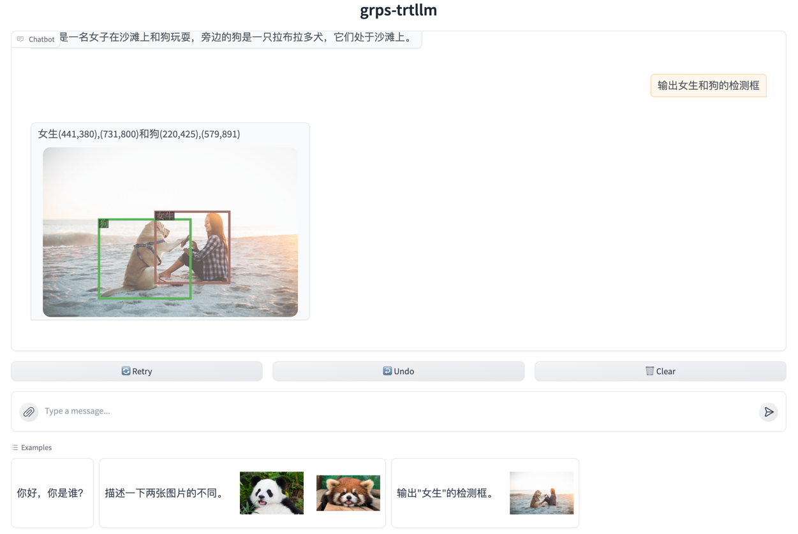

# Qwen-VL-Chat

Qwen-VL-Chat模型的部署示例。

## 演示


## 开发环境

见[快速开始](../README.md#快速开始)的拉取代码和创建容器部分。

## 构建trtllm引擎

```bash
# 下载Qwen-VL-Chat模型
apt update && apt install git-lfs
git lfs install
git clone https://huggingface.co/Qwen/Qwen-VL-Chat /tmp/Qwen-VL-Chat

# 安装依赖
pip install -r ./tools/qwenvl/requirements.txt

# 转换tiktoken tokenizer.model为huggingface tokenizer.json格式
python3 ./tools/tiktoken/tiktoken_to_hf.py /tmp/Qwen-VL-Chat/ /tmp/Qwen-VL-Chat/

# 转换ckpt，这里使用了int8 weight only量化减少显存占用
rm -rf /tmp/Qwen-VL-Chat/tllm_checkpoint/
python3 ./tools/qwenvl/convert_checkpoint.py --model_dir /tmp/Qwen-VL-Chat/ \
--use_weight_only --weight_only_precision int8 \
--output_dir /tmp/Qwen-VL-Chat/tllm_checkpoint/ --dtype bfloat16

# 构建llm引擎，根据具体显存情况可以配置不同。
# 这里设置支持最大batch_size为2，即支持2个并发同时推理，超过两个排队处理。
# 设置每个请求最多输入26个图片。
# 即：max_multimodal_len=2（max_batch_size） * 26（图片个数） * 256（每个patch对应256个token） = 13312
# 设置max_input_len为30k，max_seq_len为32k（即默认最大输出为2k）。
rm -rf /tmp/Qwen-VL-Chat/trt_engines/
trtllm-build --checkpoint_dir /tmp/Qwen-VL-Chat/tllm_checkpoint/ \
--output_dir /tmp/Qwen-VL-Chat/trt_engines/ \
--gemm_plugin bfloat16 --max_batch_size 2 --paged_kv_cache enable --use_paged_context_fmha enable \
--max_input_len 30720 --max_seq_len 32768 --max_num_tokens 32768 --max_multimodal_len 13312

# 构建vit引擎，设置--maxBS为26可以同时处理26个图片。
python3 tools/qwenvl/build_vit_engine.py --pretrainedModelPath /tmp/Qwen-VL-Chat \
--imagePath ./data/frames/frame_0.jpg \
--onnxFile /tmp/Qwen-VL-Chat/vision_encoder_bfp16.onnx \
--trtFile /tmp/Qwen-VL-Chat/vision_encoder_bfp16.trt \
--dtype bfloat16 --minBS 1 --optBS 13 --maxBS 26
```

## 构建与部署

```bash
# 构建
grpst archive .

# 部署，
# 通过--inference_conf参数指定模型对应的inference.yml配置文件启动服务。
# 如需修改服务端口，并发限制等，可以修改conf/server.yml文件，然后启动时指定--server_conf参数指定新的server.yml文件。
# 注意如果使用多卡推理，需要使用mpi方式启动，--mpi_np参数为并行推理的GPU数量。
grpst start ./server.mar --inference_conf=conf/inference_qwenvl.yml

# 查看服务状态
grpst ps
# 如下输出
PORT(HTTP,RPC)      NAME                PID                 DEPLOY_PATH         
9997                my_grps             65322               /home/appops/.grps/my_grps
```

## 模拟请求

```bash
# 测试单张图片
curl --no-buffer http://127.0.0.1:9997/v1/chat/completions \
  -H "Content-Type: application/json" \
  -d '{
    "model": "QwenVL",
    "messages": [
      {
        "role": "user",
        "content": [
          {
            "type": "image_url",
            "image_url": {
              "url": "https://qianwen-res.oss-cn-beijing.aliyuncs.com/Qwen-VL/assets/demo.jpeg"
            }
          },
          {
            "type": "text",
            "text": "这是什么"
          }
        ]
      }
    ],
    "max_tokens": 256
  }'
# 返回如下：
: '
{
 "id": "chatcmpl-1",
 "object": "chat.completion",
 "created": 1730524766,
 "model": "QwenVL",
 "system_fingerprint": "grps-trtllm-server",
 "choices": [
  {
   "index": 0,
   "message": {
    "role": "assistant",
    "content": "图中是一名女子在沙滩上和狗玩耍，旁边的狗是一只拉布拉多犬，它们处于沙滩上。"
   },
   "logprobs": null,
   "finish_reason": "stop"
  }
 ],
 "usage": {
  "prompt_tokens": 285,
  "completion_tokens": 26,
  "total_tokens": 311
 }
}
'

# 测试多轮对话与输出检测框
curl --no-buffer http://127.0.0.1:9997/v1/chat/completions \
  -H "Content-Type: application/json" \
  -d '{
    "model": "QwenVL",
    "messages": [
      {
        "role": "user",
        "content": [
          {
            "type": "image_url",
            "image_url": {
              "url": "https://qianwen-res.oss-cn-beijing.aliyuncs.com/Qwen-VL/assets/demo.jpeg"
            }
          },
          {
            "type": "text",
            "text": "这是什么"
          }
        ]
      },
      {
        "role": "assistant",
        "content": "图中是一名女子在沙滩上和狗玩耍，旁边的狗是一只拉布拉多犬，它们处于沙滩上。"
      },
      {
        "role": "user",
        "content": "输出女生的检测框。"
      }
    ],
    "max_tokens": 256
  }'
# 返回如下：
: '
{
 "id": "chatcmpl-21",
 "object": "chat.completion",
 "created": 1730598121,
 "model": "QwenVL",
 "system_fingerprint": "grps-trtllm-server",
 "choices": [
  {
   "index": 0,
   "message": {
    "role": "assistant",
    "content": "<ref>女生</ref><box>(441,382),(733,811)</box>"
   },
   "logprobs": null,
   "finish_reason": "stop"
  }
 ],
 "usage": {
  "prompt_tokens": 326,
  "completion_tokens": 23,
  "total_tokens": 349
 }
}
'

# 测试输入两张图片
curl --no-buffer http://127.0.0.1:9997/v1/chat/completions \
  -H "Content-Type: application/json" \
  -d '{
    "model": "QwenVL",
    "messages": [
      {
        "role": "user",
        "content": [
          {
            "type": "image_url",
            "image_url": {
              "url": "file://./data/image1.jpg"
            }
          },
          {
            "type": "image_url",
            "image_url": {
              "url": "file://./data/image2.jpg"
            }
          },
          {
            "type": "text",
            "text": "描述一下两张图片的不同。"
          }
        ]
      }
    ],
    "max_tokens": 256
  }'
# 返回如下：
: '
{
 "id": "chatcmpl-7",
 "object": "chat.completion",
 "created": 1730524999,
 "model": "QwenVL",
 "system_fingerprint": "grps-trtllm-server",
 "choices": [
  {
   "index": 0,
   "message": {
    "role": "assistant",
    "content": "两张图片的主要区别在于动物的种类和它们所处的环境。\n第一张图片中，是一只红色的熊猫，它正在一个木制的平台上吃竹子，环境看起来像是一个动物园。红色的熊猫比较罕见，它的皮毛看起来很柔软，毛色是红色的，而面部和四肢是黑色的。\n第二张图片中，是一只大熊猫，它正在地上吃竹子，环境看起来像是在森林中。大熊猫是黑白相间的，它的体型较大，尾巴长，前肢有短而粗的爪子，适应于树上生活。\n所以，两张图片展示的动物种类不同，第一张是红色熊猫，第二张是大熊猫，它们的生活环境也不同，第一张是在一个木制的平台上，第二张是在地上。"
   },
   "logprobs": null,
   "finish_reason": "stop"
  }
 ],
 "usage": {
  "prompt_tokens": 553,
  "completion_tokens": 164,
  "total_tokens": 717
 }
}
'
# 通过openai api进行请求
python3 client/openai_cli.py 0.0.0.0:9997 "简述一下这张图片的内容。" false "https://i2.hdslb.com/bfs/archive/7172d7a46e2703e0bd5eabda22f8d8ac70025c76.jpg"
# 返回如下：
: '
ChatCompletion(id='chatcmpl-15', choices=[Choice(finish_reason='stop', index=0, logprobs=None, message=ChatCompletionMessage(content='这张图片中有一只闭着眼睛的猫，全身白底褐色斑纹，正在水泥地面上舔舐自己的毛发。', refusal=None, role='assistant', audio=None, function_call=None, tool_calls=None))], created=1730536498, model='', object='chat.completion', service_tier=None, system_fingerprint='grps-trtllm-server', usage=CompletionUsage(completion_tokens=29, prompt_tokens=290, total_tokens=319, completion_tokens_details=None, prompt_tokens_details=None))
'
```

## 开启gradio服务



```bash
# 安装gradio
pip install -r tools/gradio/requirements.txt

# 启动多模态聊天界面，使用qwenvl多模态模型，0.0.0.0:9997表示llm后端服务地址
python3 tools/gradio/llm_app.py qwenvl 0.0.0.0:9997
```

## 关闭服务

```bash
# 关闭服务
grpst stop my_grps
```
