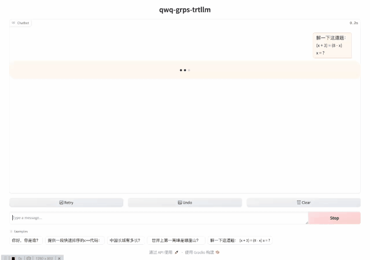

# QwQ-32B

QwQ-32B模型的部署示例。

## 演示



## 开发环境

见[快速开始](../README.md#快速开始)的拉取代码和创建容器部分。

## 构建trtllm引擎

```bash
# 下载QwQ-32B模型
apt update && apt install git-lfs
git lfs install
git clone https://huggingface.co/Qwen/QwQ-32B /tmp/QwQ-32B

# 进入TensorRT-LLM/examples/qwen目录，参考README进行构建trtllm引擎。
cd third_party/TensorRT-LLM/examples/qwen
# 转换ckpt，指定8卡tensor parallel推理。
rm -rf /tmp/QwQ-32B/tllm_checkpoint/
python3 convert_checkpoint.py --model_dir /tmp/QwQ-32B \
--output_dir /tmp/QwQ-32B/tllm_checkpoint/ --dtype bfloat16 --load_model_on_cpu --tp 8
# 构建引擎
rm -rf /tmp/QwQ-32B/trt_engines/
trtllm-build --checkpoint_dir /tmp/QwQ-32B/tllm_checkpoint/ \
--output_dir /tmp/QwQ-32B/trt_engines/ \
--gemm_plugin bfloat16 --max_batch_size 16 --paged_kv_cache enable --use_paged_context_fmha enable \
--max_input_len 32256 --max_seq_len 32768 --max_num_tokens 32256
# 回到工程根目录
cd ../../../../
```

## 构建与部署

```bash
# 构建
grpst archive .

# 部署，
# 通过--inference_conf参数指定模型对应的inference.yml配置文件启动服务。
# 如需修改服务端口，并发限制等，可以修改conf/server.yml文件，然后启动时指定--server_conf参数指定新的server.yml文件。
# 注意如果使用多卡推理，需要使用mpi方式启动，--mpi_np参数为并行推理的GPU数量。
grpst start ./server.mar --inference_conf=conf/inference_qwq.yml --mpi_np 8

# 查看服务状态
grpst ps
# 如下输出
PORT(HTTP,RPC)      NAME                PID                 DEPLOY_PATH         
9997                my_grps             65322               /home/appops/.grps/my_grps
```

## 模拟请求

```bash
# curl命令非stream请求
curl --no-buffer http://127.0.0.1:9997/v1/chat/completions \
  -H "Content-Type: application/json" \
  -d '{
    "model": "QwQ-32B",
    "messages": [
      {
        "role": "user",
        "content": "你好，你是谁？"
      }
    ]
  }'
# 返回如下：
: '
{
 "id": "chatcmpl-1",
 "object": "chat.completion",
 "created": 1741242562,
 "model": "QwQ-32B",
 "system_fingerprint": "grps-trtllm-server",
 "choices": [
  {
   "index": 0,
   "message": {
    "role": "assistant",
    "content": "嗯，用户问“你好，你是谁？”，我需要先确定他们想知道什么。可能他们第一次使用这个平台，或者对我的身份好奇。首先，我应该用中文回应，保持友好和简洁。根据之前的指示，要介绍自己是阿里巴巴集团旗下的通义实验室自主研发的超大规模语言模型，名字叫通义千问，英文名Qwen。还要提到我的功能，比如回答问题、创作文字、逻辑推理、编程等。另外，可能需要强调我的多语言能力，但用户现在用中文提问，所以重点放在中文上。还要注意不要用Markdown格式，保持口语化，避免复杂句子。可能用户需要简单的介绍，不需要太技术性的细节。还要检查有没有遗漏的关键点，比如我的应用场景，比如写故事、写公文、写邮件、写剧本等。确保回答全面但不过于冗长。最后，用友好的语气结束，比如“有什么我可以帮你的吗？”来邀请进一步的问题。现在组织一下语言，确保流畅自然。\n</think>\n\n你好！我是通义千问，阿里巴巴集团旗下的通义实验室自主研发的超大规模语言模型。你可以叫我通义千问，或者我的英文名Qwen。我能够回答问题、创作文字，比如写故事、写公文、写邮件、写剧本、逻辑推理、编程等等，还能表达观点，玩游戏等。我熟练掌握多种语言，包括但不限于中文、英文、德语、法语、西班牙语等。有什么我可以帮你的吗？"
   },
   "logprobs": null,
   "finish_reason": "stop"
  }
 ],
 "usage": {
  "prompt_tokens": 15,
  "completion_tokens": 311,
  "total_tokens": 326
 }
}
'

# curl命令stream请求
curl --no-buffer http://127.0.0.1:9997/v1/chat/completions \
  -H "Content-Type: application/json" \
  -d '{
    "model": "QwQ-32B",
    "messages": [
      {
        "role": "user",
        "content": "你好，你是谁？"
      }
    ],
    "stream": true
  }'
# 返回如下：
: '
data: {"id":"chatcmpl-2","object":"chat.completion.chunk","created":1741242598,"model":"QwQ-32B","system_fingerprint":"grps-trtllm-server","choices":[{"index":0,"delta":{"role":"assistant","content":"嗯"},"logprobs":null,"finish_reason":null}]}
data: {"id":"chatcmpl-2","object":"chat.completion.chunk","created":1741242598,"model":"QwQ-32B","system_fingerprint":"grps-trtllm-server","choices":[{"index":0,"delta":{"content":"，"},"logprobs":null,"finish_reason":null}]}
data: {"id":"chatcmpl-2","object":"chat.completion.chunk","created":1741242598,"model":"QwQ-32B","system_fingerprint":"grps-trtllm-server","choices":[{"index":0,"delta":{"content":"用户"},"logprobs":null,"finish_reason":null}]}
'

# 测试多轮对话
curl --no-buffer http://127.0.0.1:9997/v1/chat/completions \
  -H "Content-Type: application/json" \
  -d '{
    "model": "QwQ-32B",
    "messages": [
      {
        "role": "user",
        "content": "你好，你是谁？"
      },
      {
        "role": "assistant",
        "content": "嗯，用户问“你好，你是谁？”，我需要先确定他们想知道什么。可能他们第一次使用这个平台，或者对我的身份好奇。首先，我应该用中文回应，保持友好和简洁。根据之前的指示，要介绍自己是阿里巴巴集团旗下的通义实验室自主研发的超大规模语言模型，名字叫通义千问，英文名Qwen。还要提到我的功能，比如回答问题、创作文字、逻辑推理、编程等。另外，可能需要强调我的多语言能力，但用户现在用中文提问，所以重点放在中文上。还要注意不要用Markdown格式，保持口语化，避免复杂句子。可能用户需要简单的介绍，不需要太技术性的细节。还要检查有没有遗漏的关键点，比如我的应用场景，比如写故事、写公文、写邮件、写剧本等。确保回答全面但不过于冗长。最后，用友好的语气结束，比如“有什么我可以帮你的吗？”来邀请进一步的问题。现在组织一下语言，确保流畅自然。\n</think>\n\n你好！我是通义千问，阿里巴巴集团旗下的通义实验室自主研发的超大规模语言模型。你可以叫我通义千问，或者我的英文名Qwen。我能够回答问题、创作文字，比如写故事、写公文、写邮件、写剧本、逻辑推理、编程等等，还能表达观点，玩游戏等。我熟练掌握多种语言，包括但不限于中文、英文、德语、法语、西班牙语等。有什么我可以帮你的吗？"
      },
      {
        "role": "user",
        "content": "你可以做什么？"
      }
    ]
  }'
# 返回如下：
: '
{
 "id": "chatcmpl-12",
 "object": "chat.completion",
 "created": 1741243863,
 "model": "QwQ-32B",
 "system_fingerprint": "grps-trtllm-server",
 "choices": [
  {
   "index": 0,
   "message": {
    "role": "assistant",
    "content": "嗯，用户问“你可以做什么？”，我需要详细回答我的功能。首先，我应该回顾之前的对话，用户已经知道我是通义千问，但可能想更深入了解我的能力。\n\n用户可能想知道我的具体用途，比如回答问题、创作文字、编程等。我需要分点列出主要功能，确保覆盖各种场景，比如工作、学习、娱乐。同时，要保持回答自然，避免使用技术术语，让用户容易理解。\n\n还要考虑用户可能的深层需求，比如他们是否在寻找解决问题的工具，或者只是好奇。所以，我应该举一些实际例子，比如写邮件、逻辑推理、多语言支持等，这样用户能更直观地了解我的能力。\n\n另外，用户之前提到过多种语言，所以需要强调多语言支持。最后，要邀请用户提出具体需求，促进进一步互动。确保回答结构清晰，用简洁的语言，分点说明，但不过于机械，保持口语化。\n</think>\n\n作为通义千问，我可以帮助你完成以下任务：\n\n### 1. **回答问题**\n   - 学术问题（如科学、历史、技术等）\n   - 日常知识（如菜谱、旅行建议、健康小贴士等）\n   - 专业领域问题（如法律、金融、医学等基础咨询）\n\n### 2. **创作文字**\n   - 写故事、小说、诗歌\n   - 撰写公文、邮件、简历、报告\n   - 创作剧本、对话脚本、演讲稿\n\n### 3. **逻辑与推理**\n   - 解决数学问题、逻辑谜题\n   - 提供决策建议或分析\n   - 辩论或观点表达（如模拟辩论、观点阐述）\n\n### 4. **编程辅助**\n   - 编写代码（支持多种编程语言，如Python、Java、C++等）\n   - 调试代码、解释错误\n   - 提供编程学习建议\n\n### 5. **多语言支持**\n   - 翻译：中、英、法、西、德、日、韩等多语言互译\n   - 多语言对话和创作\n\n### 6. **娱乐互动**\n   - 玩文字游戏（如成语接龙、猜谜语）\n   - 讲笑话、编故事\n   - 角色扮演（如模拟朋友聊天、虚构人物对话）\n\n### 7. **信息处理**\n   - 总结长篇文章或文档\n   - 提取关键信息、生成摘要\n   - 整理笔记或会议记录\n\n### 8. **个性化服务**\n   - 根据你的需求定制内容（如生成个性化学习计划）\n   - 提供创意灵感（如设计活动方案、广告文案）\n\n### 9. **教育辅助**\n   - 解释复杂概念（如物理、数学原理）\n   - 提供学习资源推荐\n   - 模拟考试题目与解答\n\n---\n\n如果你有任何具体需求或问题，可以直接告诉我，我会尽力帮你！ 😊"
   },
   "logprobs": null,
   "finish_reason": "stop"
  }
 ],
 "usage": {
  "prompt_tokens": 126,
  "completion_tokens": 638,
  "total_tokens": 764
 }
}
'

# 测试解答数学题
curl --no-buffer http://127.0.0.1:9997/v1/chat/completions \
  -H "Content-Type: application/json" \
  -d '{
    "model": "QwQ-32B",
    "messages": [
      {
        "role": "user",
        "content": "解一下这道题：\n(x + 3) = (8 - x)\nx = ?"
      }
    ],
    "max_tokens": 2048
  }'
# 返回如下：
: '
{
 "id": "chatcmpl-8",
 "object": "chat.completion",
 "created": 1741243625,
 "model": "QwQ-32B",
 "system_fingerprint": "grps-trtllm-server",
 "choices": [
  {
   "index": 0,
   "message": {
    "role": "assistant",
    "content": "嗯，我现在要解这个方程：(x + 3) = (8 - x)，然后求x的值。好，先别急着动手，先仔细看看题目有没有哪里看错的地方。题目是说x加3等于8减x，对吧？看起来没问题。那我要找x的值，使得两边相等。\n\n首先，我应该把方程写下来：x + 3 = 8 - x。接下来，我需要把所有的x项移到一边，常数项移到另一边。通常的做法是把x项都移到左边，常数移到右边。那我试试看。\n\n首先，可能需要把右边的-x移到左边，这样左边就会变成x + x +3，而右边剩下8。或者，也可以在两边同时加上x，这样右边的-x就被消掉了。对，这样可能更简单。让我试一下：\n\n两边同时加上x的话，左边就是x + 3 + x，也就是2x + 3，右边就是8 -x +x，也就是8。这样方程变成2x +3 =8。对吗？是的，这样操作是对的，因为加x两边都加了，所以等式不变。\n\n接下来，我需要把3移到右边。也就是把左边的3减掉，同时右边也要减3。于是：\n\n2x +3 -3 =8 -3，这样左边剩下2x，右边是5。所以2x=5。那接下来，解x的话，只需要两边都除以2，得到x=5/2，也就是2.5。对吗？\n\n不过，我应该再检查一下我的步骤有没有哪里出错。让我再重新过一遍：\n\n原式：x +3 =8 -x\n\n加x两边：x +x +3 =8 → 2x +3=8\n\n减3两边：2x =8-3 →2x=5\n\n除以2：x=5/2。没错，这个过程是对的。\n\n不过，为了确保正确，最好代入原式看看是否成立。\n\n左边：x+3 = (5/2)+3 = 5/2 +6/2=11/2=5.5\n\n右边：8 -x =8 -5/2=16/2 -5/2=11/2=5.5。两边相等，所以解是对的。\n\n或者，可能还有其他方法解这道题？比如，先把3移到右边，-x移到左边？\n\n让我试试另一种方法：\n\n原式：x +3 =8 -x\n\n把右边的- x移到左边变成+x，左边的+3移到右边变成-3：\n\nx +x =8 -3 →2x=5 →x=5/2。结果还是一样的，所以没问题。\n\n看来不管用哪种方法，结果都是x=5/2，也就是2.5。所以答案应该是正确的。\n\n不过，可能还有其他需要注意的地方吗？比如，有没有可能在移项的时候符号弄错了？\n\n比如，当我在原式两边加x的时候，右边的-x加x确实会抵消，变成8。左边的x加x是2x，加上原来的3，没错。或者，如果我在移项的时候把3移到右边，变成x +x =8 -3，这样也是正确的。所以没有问题。\n\n或者，有没有可能在计算分数的时候出错？比如5除以2是2.5，没错，或者写成假分数5/2也是对的，根据题目要求，可能需要写分数形式还是小数？\n\n题目没有特别说明，所以两种都可以，但数学题通常更倾向于分数，所以可能5/2更合适。\n\n总之，我觉得这个解法是对的，而且代入验证也成立，应该没问题。不过，为了彻底确认，再考虑有没有其他可能的解法？\n\n比如，可能展开括号？不过原式里的括号其实没有实际作用，因为x+3和8-x本来就已经是展开的形式了，所以括号可以忽略。所以不需要特别处理括号。\n\n或者，有没有可能在移项时犯了其他错误？比如，符号错误？\n\n比如，如果我把原式写成x +3 =8 -x，然后把左边的x移到右边，把右边的-x移到左边？或者说，把3移到右边，得到x =8 -x -3？这样会不会？\n\n是的，这样也是可以的：\n\n原式：x +3 =8 -x\n\n把左边的x移到右边的话，应该是把3移到右边，得到x =8 -x -3，也就是x =5 -x。然后两边加上x，得到x +x =5 →2x=5 →x=5/2。同样得到同样的结果。\n\n所以不管怎么移项，结果都是一样的。看来这个解是正确的。\n\n总结一下，解这个方程的步骤是：\n\n1. 将含x的项移到左边，常数移到右边：\n\n   x +3 =8 -x\n\n   加x两边：2x +3 =8\n\n   减3两边：2x =5\n\n2. 解得x=5/2。\n\n或者：\n\n1. 将3移到右边，得到x =8 -x -3 →x =5 -x\n\n2. 加x到两边：2x =5 →x=5/2。\n\n两种方法都正确，结果一致，所以正确。\n\n因此，答案应该是x=5/2，或者写成2.5。不过在数学题中，分数形式更常见，所以用5/2更合适。\n\n再检查一次代入：\n\n左边：5/2 +3 =5/2 +6/2=11/2\n\n右边：8 -5/2 =16/2 -5/2=11/2\n\n两边相等，没错。\n\n所以最终答案是x=5/2。\n\n**答案**\nx = \\boxed{\\dfrac{5}{2}}\n</think>\n\n解方程 \\( (x + 3) = (8 - x) \\)：\n\n1. 将方程中的 \\( x \\) 项移到左边，常数项移到右边：\n   \\[\n   x + 3 = 8 - x\n   \\]\n   两边同时加上 \\( x \\)：\n   \\[\n   x + x + 3 = 8\n   \\]\n   简化得到：\n   \\[\n   2x + 3 = 8\n   \\]\n\n2. 将常数项移到右边：\n   \\[\n   2x = 8 - 3\n   \\]\n   简化得到：\n   \\[\n   2x = 5\n   \\]\n\n3. 解 \\( x \\)：\n   \\[\n   x = \\frac{5}{2}\n   \\]\n\n验证解的正确性：\n- 左边：\\( \\frac{5}{2} + 3 = \\frac{5}{2} + \\frac{6}{2} = \\frac{11}{2} \\)\n- 右边：\\( 8 - \\frac{5}{2} = \\frac{16}{2} - \\frac{5}{2} = \\frac{11}{2} \\)\n\n两边相等，解正确。\n\n最终答案：\n\\[\nx = \\boxed{\\dfrac{5}{2}}\n\\]"
   },
   "logprobs": null,
   "finish_reason": "stop"
  }
 ],
 "usage": {
  "prompt_tokens": 30,
  "completion_tokens": 1557,
  "total_tokens": 1587
 }
}
'

# openai_func_call.py进行function call模拟
python3 client/openai_func_call.py 127.0.0.1:9997
# 返回如下：
: '
Query server with question: What's the weather like in Boston today? ...
Server response: thought: None, call local function(get_current_weather) with arguments: location=Boston, MA, unit=fahrenheit
Send the result back to the server with function result(59.0) ...
Final server response: Okay, the user asked, "What's the weather like in Boston today?" I need to figure out how to respond based on the tool response provided. The tool response is just "59.0". Wait, that seems a bit vague. Let me check the function call again. The function used was get_current_weather with arguments for location (Boston, MA) and unit (fahrenheit). The tool response returned 59.0, which I assume is the temperature in Fahrenheit. 

Hmm, but the user might expect more details than just the temperature. Maybe the function is designed to return only the temperature, but typically weather includes conditions like sunny, cloudy, etc. Since the tool's response only has a number, I should stick to what's provided. I'll state the temperature clearly. Let me make sure to mention the unit as well since the user specified Fahrenheit in the function call. 

So the answer should be straightforward: The current temperature in Boston is 59.0°F. I should present it in a friendly and clear manner. Wait, maybe add a brief note about the feeling, like " mild" or something? But since there's no additional data, maybe keep it simple. Just the temperature as given. Alright, that's the plan.
</think>

The current temperature in Boston is **59.0°F**. Let me know if you need additional weather details!
'

# openai_func_call2.py进行一次两个函数的function call模拟
python3 client/openai_func_call2.py 127.0.0.1:9997
# 返回如下：
: '
Query server with question: What's the postcode of Boston and what's the weather like in Boston today? ...
Server response: thought: None, call local function(get_postcode) with arguments: location=Boston, MA
Server response: thought: None, call local function(get_current_weather) with arguments: location=Boston, MA, unit=fahrenheit
Send the result back to the server with function result ...
Final server response: Okay, let me process the user's query step by step. The user asked for two things: the postcode of Boston and the current weather in Boston. 

First, I need to check the tool responses. The get_postcode function returned 02138. That's straightforward. But wait, postcodes can sometimes have multiple numbers depending on the area. Maybe I should note that 02138 is a common one, but there might be others. However, since the tool gave a single response, I'll go with that unless specified otherwise.

Next, the weather part. The get_current_weather returned 59.0, but the unit was set to Fahrenheit. The user didn't specify the unit, but the function required it, so I chose Fahrenheit by default. I should present the temperature in Fahrenheit and mention the unit to avoid confusion. 

Putting it all together, the answer should clearly state the postcode and the temperature with the unit. I should also make sure the response is friendly and concise, addressing both parts of the question without extra fluff. Let me double-check the parameters to ensure I used the right location "Boston, MA" which seems correct. Alright, ready to format the answer.
</think>

The postcode for Boston, MA is **02138**. The current temperature in Boston today is **59.0°F**.
'

# llama-index ai agent模拟
pip install llama_index llama_index.llms.openai_like
python3 client/llamaindex_ai_agent.py 127.0.0.1:9997
# 返回如下：
: '
Query: What is the weather in Boston today?
Added user message to memory: What is the weather in Boston today?
=== Calling Function ===
Calling function: get_weather with args: {"location":"Boston, MA","unit":"fahrenheit"}
Got output: 59.0
========================

Response: Okay, the user asked for the weather in Boston today. I need to use the get_weather function. The function requires location and unit. The user didn't specify the unit, so I'll default to Fahrenheit since they're in the US. Location is Boston, so I'll use "Boston, MA" as the state might be needed. 

After calling the function, the response was 59.0. Now I need to present this clearly. Let me check if the unit was correct. Since I used Fahrenheit, the temperature is 59°F. I should state that simply.

Wait, maybe the user wants more details like conditions, but the function only gives temperature. Oh well, I'll just provide what I have. Make sure to mention the location and unit clearly. Keep the answer straightforward.
</think>

The current temperature in Boston, MA is 59.0°F.
'
```

## 开启gradio服务

```bash
# 安装gradio
pip install -r tools/gradio/requirements.txt

# 启动纯文本聊天界面，qwq支持CoT过程的纯文本聊天，0.0.0.0:9997表示llm后端服务地址
python3 tools/gradio/llm_app.py qwq 0.0.0.0:9997
```

## 关闭服务

```bash
# 关闭服务
grpst stop my_grps
```