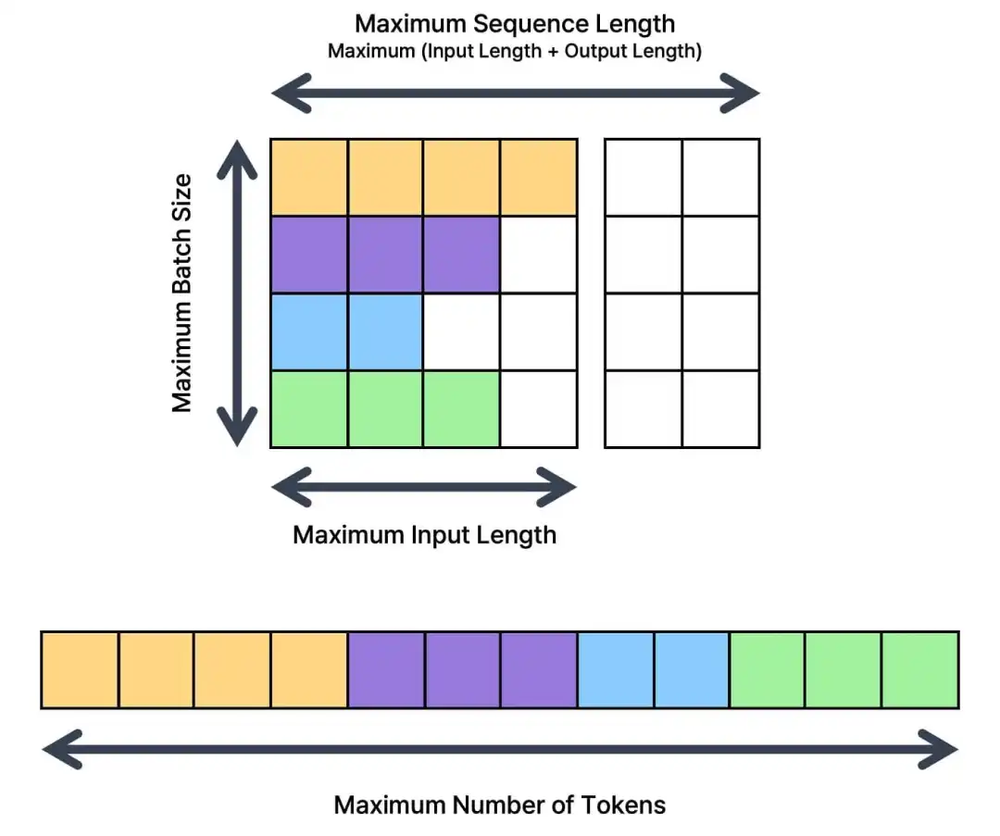
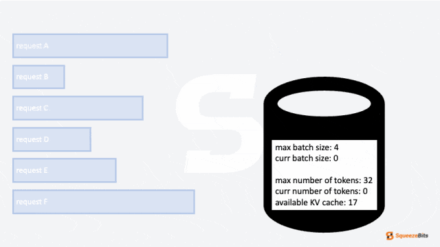
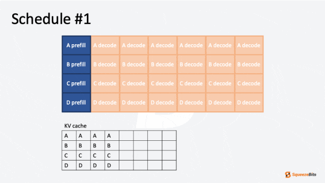
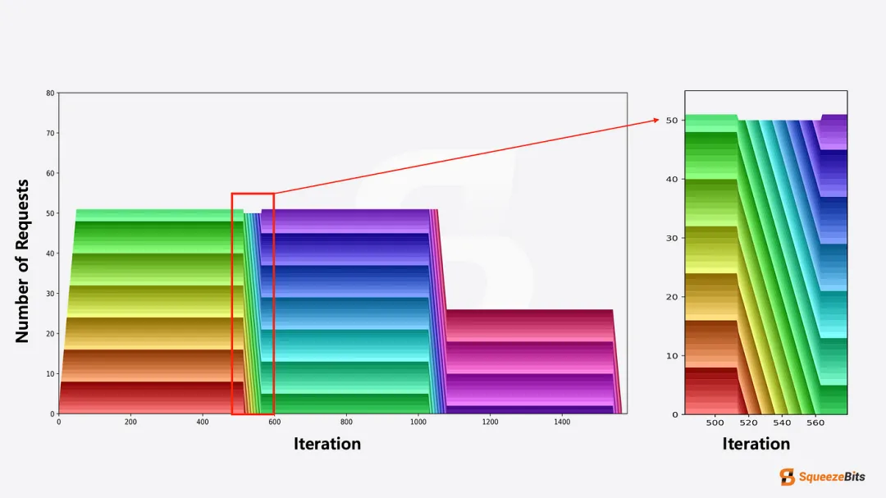
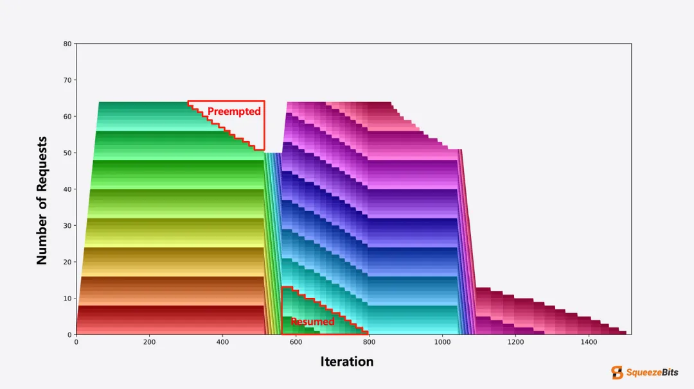

# 请求调度策略说明

一些重要参数的配置会影响的服务请求的调度策略。包含构建参数（trtllm-build过程参数）、服务部署参数（inference_*
.yml）中的```trtllm config```部分、以及服务并发限制参数（server.yml）中的```max_concurrency```参数。

## LLM推理两个阶段

在深入探讨关键参数之前，让我们先分解文本生成的两个阶段：```Prefill```阶段和```Decode```
阶段。在预填充阶段，模型处理所有输入token以创建上下文（context），并生成第一个输出token，然后使用该输出token生成后续的输出token。接下来是解码阶段，模型自回归地生成输出，使用预填充阶段创建的上下文以及先前的输出。
在预填充阶段，所有输入token会同时被送入模型。这使得预填充阶段计算密集。另一方面，在解码阶段，只有最近生成的token会被送入模型。之前的上下文会从KV缓存中加载，以减少重复计算。加载KV缓存会导致显著的内存传输开销，使解码阶段成为内存受限。因此，由于这两个阶段的特性不同，关键参数对每个阶段的影响也不同。

## 构建参数



* max_batch_size：定义了可以同时处理的请求的最大数量。较大的批量大小允许更多的token并行生成，增加吞吐量。然而，增加批量大小需要更多的KV缓存和激活内存。

* max_num_tokens：限制了每次迭代处理的token数量。增加此值通常可以通过容纳更长的序列和更大的批量来提高吞吐量。增加激活张量的大小有助于更好地利用硬件的计算资源。

当多个请求到来时，调度器根据这两个参数进行批量处理。在预填充阶段，批量大小通常受到最大token数的限制，因为每个请求的输入token数量较大。另一方面，最大token数在解码阶段通常不会起决定性作用，因为输入token的数量较少，很难达到最大token数。相反，最大批量大小在解码阶段起着关键作用，限制了解码阶段的批量大小。
当然上面两个参数也会受到服务部署时具体的KV Cache大小的限制，例如当KV Cache显存不足时，并发的请求可能并不能打到max_batch_size，如下文服务部署参数章节所述。

## 服务部署参数

### kv_cache_free_gpu_mem_fraction

该参数用于设置KV缓存的内存占用比例。该参数的默认值为0.9，表示使用GPU上空闲（模型加载后剩余的显存）的90%的显存用于KV缓存。KV缓存是很重要的，富足的KV
Cache可以使服务达到更高的吞吐量，一般建议设置为0.9~0.95，当显存不足导致服务启动失败时可以相应减少它。它不能设置为1.
0，因为还要留一些显存给输入输出使用。另外对请求调度也有很大的影响，尤其是KV
Cache很小时可能导致请求进入排队执行，如batch_scheduler_policy小节所述。<br>
具体我们设置的比例可以缓存多少Token的KV Cache，可以在服务启动最后的日志或者```grpst logs my_grps```查看到的如下日志来确认：

```text
[TensorRT-LLM][INFO] Memory usage when calculating max tokens in paged kv cache: total: 22.18 GiB, available: 1.42 GiB
[TensorRT-LLM][INFO] Number of blocks in KV cache primary pool: 82
[TensorRT-LLM][INFO] Number of blocks in KV cache secondary pool: 0, onboard blocks to primary memory before reuse: true
[TensorRT-LLM][WARNING] maxAttentionWindow and maxSequenceLen are too large for at least one sequence to fit in kvCache. they are reduced to 5185
[TensorRT-LLM][WARNING] maxInputLen is reduced to 5184
[TensorRT-LLM][INFO] Max KV cache pages per sequence: 82
[TensorRT-LLM][INFO] Number of tokens per block: 64.
[TensorRT-LLM][INFO] [MemUsageChange] Allocated 1.28 GiB for max tokens in paged KV cache (5248).
```

通过上面日志我们能最后确认当前申请的KV Cache只能缓存5248个tokens。

### batch_scheduler_policy

在介绍调度策略前，需要先介绍一下KV缓存（KV Cache）对请求调度的影响：当没有足够的剩余 KV 缓存存储请求的上下文，该请求将无法被调度。



与其他限制因素不同，管理 KV 缓存大小并非确定性的——它会随着每个生成的 token 增长，最终可能扩展到最大输出 token 长度。因此，管理剩余
KV 缓存涉及一定程度的估算。与其他估算挑战类似，我们可以采用悲观或乐观的方式分配 KV
缓存。这两种策略分别称为预分配（preallocation）和按需分配（on-demand allocation）。

在预分配中，一旦请求被调度，其 KV 缓存的内存空间会基于输入 token 数量和最大生成 token
数量（请求的max_tokens参数）之和进行保留。这种方法确保了在解码阶段不会出现内存不足的情况，因为所需的最大 KV
缓存内存已经提前分配。TensorRT-LLM
使用预分配作为其默认策略，被称为 ```GUARANTEED_NO_EVICT```。

预分配内存以支持最大 KV 缓存大小可能会导致内存使用效率低下，因为并非所有请求都会生成其最大 token 限制的内容。相比之下，按需分配会动态分配
KV 缓存内存，而不是预先保留最大值。
按需分配随着 token 的生成动态分配 KV 缓存内存，而不是预先为最大值保留内存。这种方法是 vLLM 的唯一策略，也是 TensorRT-LLM
的另一种策略，被称为 ```MAX_UTILIZATION```。这种策略帮助最小化内存浪费，并允许更大的批次大小，但它引入了 KV
缓存耗尽（preemption）的风险。

当活动批次中的请求上下文长度随着更多文本生成而增长时，可能会需要额外的按需 KV 缓存分配。如果可用 KV
缓存内存不足，就会发生预警。在这种情况下，批次中的某些请求必须被中断，其 KV 缓存需要被清除以释放内存，从而避免死锁。清除可以通过两种方式实现：将
KV 缓存交换到主存储器（host memory）或完全丢弃缓存。

* 交换（Swapping）：当请求被中断时，将 KV 缓存转移到主存储器，随后在请求恢复时再将其加载回内存。
* 丢弃（Dropping）：直接丢弃 KV 缓存，同时存储上下文和已生成的 token。在请求恢复时，KV 缓存在预填充阶段重新计算。



与交换相比，丢弃更常被优先选择，因为主存储器的读写操作会引入显著的开销。而丢弃仅需要一次预填充迭代，将先前生成的 token 与原始输入
token 连接即可，因此在大多数情况下是一种更高效的选项。

GUARANTEED_NO_EVICT 策略调度多个请求的示例：



图中，每个请求以不同颜色表示。可以看到，每个请求需要 512 次迭代（输出长度设置为
512）。新的请求会在前一个请求完成后立即被加入。这种调度行为展示了连续批处理的核心原则，特别是迭代级调度，因为新请求会在完成的请求后立刻被引入。

MAX_UTILIZATION 策略调度多个请求的示例：



在图中，可以观察到预警的存在。被中断的请求会从调度中移除，并在后续迭代中恢复。尽管存在预警，连续批处理的模式在图 7 中仍然清晰可见。

通过修改inference_*.yml中的```batch_scheduler_policy```可以修改不同的调度策略，可以设置为```guaranteed_no_evict```,
```max_utilization```对应上面的两种策略。两种策略最显著的不同在于，当我们客户端发送的请求的```max_tokens```
参数非常大时以至于和上下文tokens数量加起来已经超过KV
Cache的最大token数量，```guaranteed_no_evict```策略会导致请求进入排队处理，```max_utilization```则可以使请求并行处理，当KV
Cache用尽时，部分请求的KV
Cache需要进行恢复，导致这些请求的token延迟增高。用户可以按需进行配置。

需要注意的是使用```max_utilization```策略需要同时在```trtllm-build```时使能```--use_paged_context_fmha
```以及使能部署参数（inference_*.yml）```enable_chunked_context```才能生效。

## 服务并发限制参数

服务并发限制参数```max_concurrency```用于最外层限制服务的最大并发请求数。它也会影响到请求的调度策略，当当前服务正在处理的请求数已经达到
```max_concurrency```时，后续请求会进入排队处理。

## 参考文章

* [vLLM vs TensorRT-LLM Which Scheduler Wins?](https://medium.com/squeezebits-team-blog/vllm-vs-tensorrt-llm-4-which-scheduler-wins-2dc15283522a)